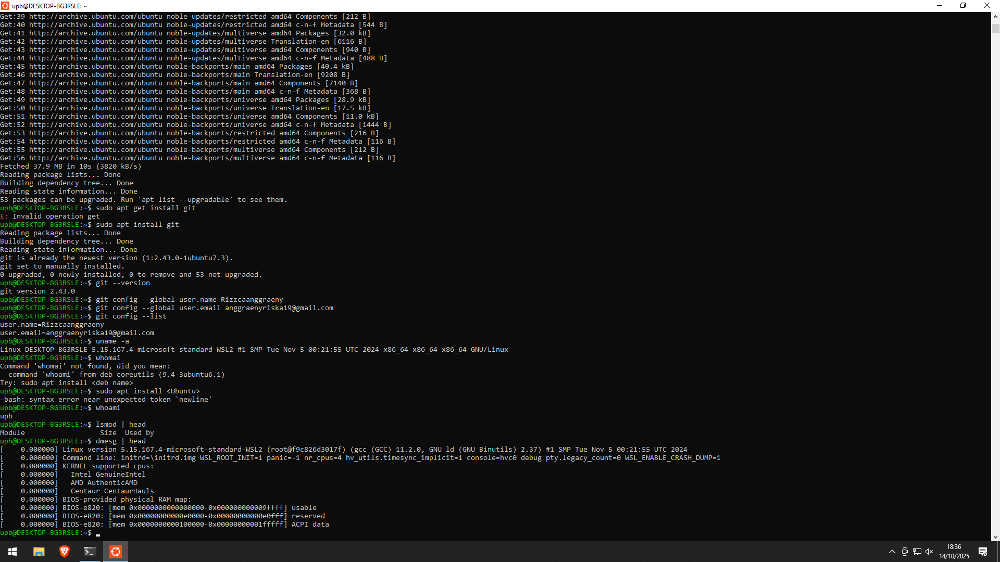

# Laporan Praktikum Minggu [1]
Topik:  "Arsitektur Sistem Operasi dan Kernel"

---

## Identitas
- **Nama**  : Rizzca Anggraeny
- **NIM**   : 250320578  
- **Kelas** : 1DSRA

---

## Tujuan
Tuliskan tujuan praktikum minggu ini.  
> Dpat menjelaskan fungsi utama sistem operasi dan peran kernel serta system call.
> Mengidentifikasi komponen utama OS (kernel,system call, device driver, file system).
> Membandingkan model arsitektur OS (monolithic, layered, microkernel).
> Menggambarkan diagram sederhana arsitektur OS menggunakan alat bantu digital (draw.io / mermaid).


---

## Dasar Teori
Tuliskan ringkasan teori (3–5 poin) yang mendasari percobaan.
> 1. Sistem Operasi
Perangkat lunak yang mengelola hardware dan menyediakan layanan untuk aplikasi.
2. Arsitektur Sistem Operasi
Monolithic Kernel: Semua fungsi OS berjalan dalam satu ruang kernel (cepat tapi kurang stabil).
Microkernel: Kernel hanya fungsi dasar, layanan lain di user space (lebih stabil tapi lebih lambat).
Hybrid Kernel: Kombinasi keduanya, modul bisa ditambah atau dilepas.
3. Kernel
Bagian inti OS yang mengatur proses, memori, perangkat I/O, dan sistem file.
4. Mode Kernel dan User
Kernel mode: Hak akses penuh, jalankan tugas inti OS.
User mode: Hak terbatas, untuk aplikasi agar sistem aman dan stabil.
---

## Langkah Praktikum
1. Setup Environment Pastikan Linux (Ubuntu/WSL) sudah terinstal. Pastikan Git sudah dikonfigurasi dengan benar dengan perintah yang dijalankan:
   `git config-global user.name "Nama Anda`
   `git config --global user.email "email@contoh.com`
   Diskusi Konsep Baca materi pengantar tentang komponen OS Identifikasi komponen yang ada pada Linux/Windows/Android. Eksperimen Dasar Jalankan perintah berikut di terminal
   `uname -a`
   `whoami`
   `Ismod | head`
   `dmesg | head`
   Catat dan analisis modul kernel yang tampil. Membuat Diagram Arsitektur Buat diagram hubungan antara User-System Call-Kernel-Hardware. Gunakan draw.io atau Mermaid. Simpan hasilnya de praktikum/week 1-intro-arsitektur
   os/screenshots/diagram os.png Penulisan Laporan Tuliskan hasil pengamatan, analisis, dan kesimpulan ke dalam laporan.md. Tambahkan screenshot hasil terminal ke folder screenshots/ Commit & Push git add git commit
   "Minggu 1-Arsitektur Sistem Operasi dan Kernel" git push origin main
   
3. Perintah yang dijalankan.
`uname -a`
`lsmod | head`
`dmesg | head`
4. File dan kode yang dibuat.  
5. Commit message yang digunakan.

---

## Kode / Perintah
Tuliskan potongan kode atau perintah utama:
```bash
uname -a
lsmod | head
dmesg | head
```

---

## Hasil Eksekusi
Sertakan screenshot hasil percobaan atau diagram:



---

## Analisis
- Perintah `uname -a` menampilkan veri kernel dan pld form anda yang menunjukan bahwa ini adalah sistem 64-bit yang berjalan dalam WSL2.
  Perintah `whoami` menunjukkan bahwa anda saat ini login sebagai upb
  Perintah `lsmod | head` menampilkan daftar modul kernel Linux yang aktif beserta informasi penting yaitu nama modul, ukuran modul di memori, dan berapa banyak modul atau proses lain yang menggunakan modul tersebut.
  Informasi ini membantu mengetahui modul apa saja yang berjalan, berapa besar memori yang dipakai, serta memastikan modul tidak dihapus saat masih digunakan oleh sistem.
  Perintah `dmesg | head`, untuk melihat ringkasan awal dari log kernel
- Hubungan hasil dengan teori (fungsi kernel, system call, arsitektur OS) yaitu :
  Dengan adanya arsitektur OS, Menunjukkan kermel Linux berjalan di atas Windows (arsitektur hybrid)
- Perbedaan hasil di lingkungan OS berbeda Sumut vs Windows yaitu WSL2 (Linux di atas Windows) Cocok untuk pengembangan scripting dan testing Linux tools di Windows Tidak cocok untuk operasi kernel-level atau akses
  hardware langsung. Linux Asli (native) cocok untuk penggunaan penuh: server, embedded system, konfigurasi kamel dll

---

## Kesimpulan
Tuliskan 2–3 poin kesimpulan dari praktikum ini.
1. Perintah `uname -a` dan whoami menunjukkan bahwa sistem yang digunakan adalah Linux 64-bit yang berjalan di lingkungan WSL2 dengan akses user upb, menandakan penggunaan Linux virtual di atas Windows.

2. Deteksi modul kernel `lsmod | head`dan log awal kernel `dmesg | head` mengonfirmasi fungsi kernel dalam mendeteksi perangkat keras (CPU Intel dan AMD) dan memulai sistem menggunakan system call untuk konfigurasi awal, sesuai dengan teori anitektur dan fungsi kernel

3. Perbedaan lingkungan OS terlihat dan WSL2 yang cocok untuk pengembangan dan pengujian Linus di Windrowy dengan ketentuan akoes hardware langsung, sedangkan Linux native lebih optimal untuk penggunaan penuh seperti server dan pengelolaan
---
## Tugas
Ringkasan Arsitektur Kernel Sistem Operasi

Arsitektur kernel merupakan fondasi utama sistem operasi (OS) yang menentukan bagaimana komponen-komponen seperti manajemen proses, memori, dan perangkat keras diintegrasikan. Tiga model utama yang sering dibahas adalah monolithic kernel, microkernel, dan layered architecture. Ketiganya memiliki perbedaan mendasar dalam hal modularitas, performa, keamanan, dan kompleksitas.
Monolithic Kernel adalah arsitektur yang dimana semua komponen kernel termasuk sistem file, driver perangkat, jaringan, dan manajemen proses berjalan di satu alamat kernel yang sama. Seluruh layanan diintegrasikan secara ketat, jadi komunikasi antar-komponen sangat cepat melalui panggilan fungsi langsung. Kelebihannya adalah tingkat performa yang tinggi dan efisiensi karena tidak ada biaya switch konteks yang signifikan. Namun, kelemahannya adalah tidak modularitas: erornya di satu modul (misal, driver yang jelek) bisa menyebabkan crash sistem keseluruhan, dan debugging sulit karena kode monolithic. Model ini cocok untuk sistem dengan prioritas kecepatan.
Contoh OS nyata : Linux Kernel (digunakan di distribusi seperti Ubuntu dan Android) merupakan contoh klasik monolithic. Selain itu, Windows NT Kernel juga kategori monolithic meskipun memiliki elemen hybrid, di mana daerah mayoritas layanan berjalan pada mode kernel.
Microkernel, sebaliknya, dirancang minimalis. Kernel hanya menangani fungsi dasar seperti inter-process communication (IPC), penjadwalan proses, dan manajemen ruang alamat. Layanan lain seperti driver, sistem file, dan server jaringan dijalankan sebagai proses user-space terpisah. Komunikasi dilakukan melalui pesan IPC, yang membuat arsitektur ini sangat modular dan aman jika satu layanan gagal, sistem lain tetap berfungsi. Keuntungannya termasuk kemudahan pemeliharaan, portabilitas, dan keamanan yang lebih baik, karena isolasi antar-komponen mencegah propagasi kesalahan. Namun, IPC overhead membuat performa menjadi lebih rendah dari monolithic, terutama untuk operasi berat. 
Contoh OS nyata: Minix (popularized oleh Andrew Tanenbaum sebagai tools pengajaran) dan QNX (digunakan di sistem embedded otomotif dan medis) adalah microkernel pure. Selain itu, keluarga L4 (seperti seL4) diterapkan di perangkat IoT dan militer untuk keamanan tingkat tinggi. Layered Architecture dibagi OS ke dalam lapisan-lapisan hierarki, setiap lapisan yang bergantung pada lapisan di bawahnya. Lapisan terendah langsung berinteraksi dengan hardware, sedangkan lapisan atas menangani antarmuka pengguna. Komunikasi mengalir secara vertikal melalui antarmuka terdefinisi, seperti protokol OSI. Kelebihannya adalah modularitas yang baik, memudahkan pengembangan dan pengujian terpisah, serta mudah menambahkan lapisan baru. Kekurangannya adalah performa yang dapat lambat karena data harus melalui multiple lapisan, dan ketergantungan hierarki dapat menciptakan bottleneck.
Contoh OS nyata: THE (Technische Hogeschool Eindhoven) OS tahun 1960-an adalah suatu contoh awal layered architecture. Multics (predecesor Unix) juga menggunakan model ini, dan komponennya terlihat di beberapa OS kuno seperti OS/360 IBM. Sekarang ini, layered lebih umum di OS spesifik seperti beberapa embedded system varian, tapi sepihaknya jarang. Analisis Relevansi untuk Sistem Modern
Di era sistem modern yang didominasi oleh komputasi cloud, IoT, dan perangkat mobile, monolithic kernel seperti Linux tetap paling relevan untuk kebanyakan aplikasi general-purpose alasannya adalah performa superior yang dibutuhkan untuk multitasking berat, skalabilitas di server (misalnya, AWS menggunakan Linux), dan ekosistem pengembang yang luas. Linux mendukung modul kernel yang bisa dimuat/dilepas secara dinamis, mengurangi kekurangan monolithic tradisional. Namun, untuk sistem safety-critical seperti mobil otonom atau perangkat medis, microkernel seperti QNX lebih relevan karena keamanan dan reliabilitasnya sertifikasi seperti ISO 26262 menuntut isolasi ketat. Layered architecture kurang relevan hari ini; meskipun konsepnya memengaruhi desain modular modern (seperti di Android dengan lapisan HAL), ia sering digantikan oleh hybrid models yang menggabungkan elemen monolithic dan micro untuk keseimbangan performa-keamanan.
Secara umumnya, trend ke arah hybrid kernel (misalnya, pada macOS XNU) menunjukkan perkembangan, namun monolithic tetap mendominasi karena efisiensi di perangkat multicore dan virtualisasi. Cita model konteks-dependent: performa untuk desktop/server, keamanan untuk embedded.

## Quiz
1. Sebutkan tiga fungsi utama sistem operasi.
   Jawaban:
1. Manajemen Proses (Process Management):
   Mengatur jalannya proses-proses di dalam sistem, termasuk penjadwalan, pembuatan, penghentian, dan sinkronisasi proses.
3. Manajemen Memori (Memory Management):
   Mengelola penggunaan memori utama (RAM) oleh berbagai proses, termasuk alokasi, de-alokasi, dan perlindungan antar proses.
5. Manajemen Perangkat I/O (Input/Output):
   Mengatur interaksi antara perangkat keras input/output dan sistem, termasuk driver, buffer dan komunikasi dengan perngkat eksternal
2. Jelaskan perbedaan antara kernel mode dan user mode.
   Jawaban : Kernel mode adalah mode dimana OS memiliki kontrol penuh atas sistem, sedangkan user mode adalah mode terbatas dimana
   aplikasi berjalan agar tidak langsung memengaruhi sistem inti.
3. Sebutkan contoh OS dengan arsitektur monolithic dan microkernel.
   Jawaban : Monolithic Kernel contohnya: Linux, MS-DOS, Unix Tradisional
   Ciri: Semua layanan OS (driver, file system, dll.) berjalan dalam satu ruang kernel. Lebih cepat, tetapi lebih rentan terhadap
   kerusakan sistem karena semuanya terintegrasi.
   Microkernel Contohnya: Minix, QNX, L4, macOS
   Ciri: Hanya fungsi inti OS (seperti komunikasi antar proses dan manajemen memori) berada di kernel, layanan lainnya dijalankan di user
   space. Lebih stabil dan modular, tetapi bisa sedikit lebih lambat. 

---

## Refleksi Diri
Tuliskan secara singkat:
- Apa bagian yang paling menantang minggu ini?
  Bagian yang paling menantang pada minggu ini adalah pemecahan masalah terkait praktikum yang diberikan dimatkul operasi sistem
- Bagaimana cara Anda mengatasinya?
  Cara saya mengatasinya yaitu dengan sharing kepada teman dan mencari referensi diberbagai website terkait

---

**Credit:**  
_Template laporan praktikum Sistem Operasi (SO-202501) – Universitas Putra Bangsa_
