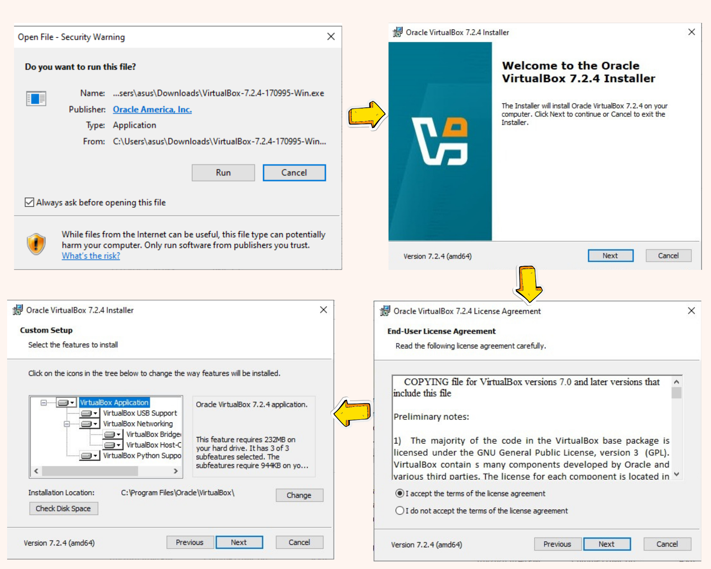
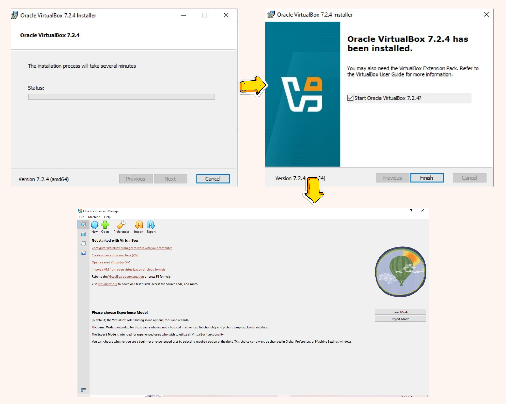
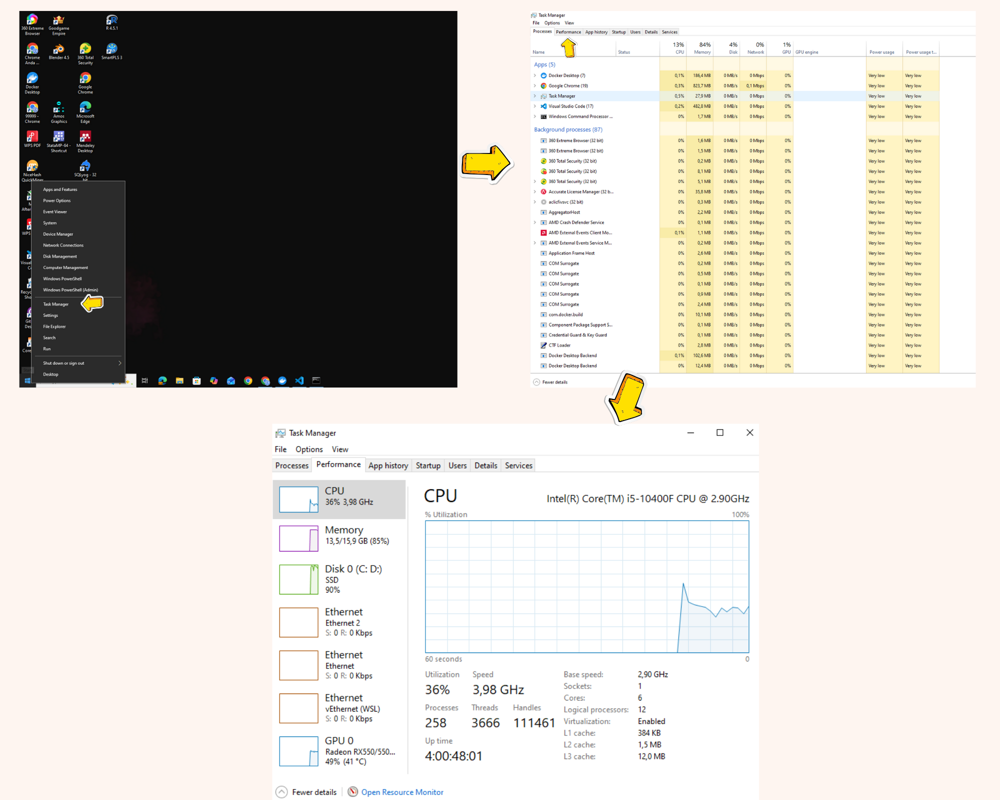
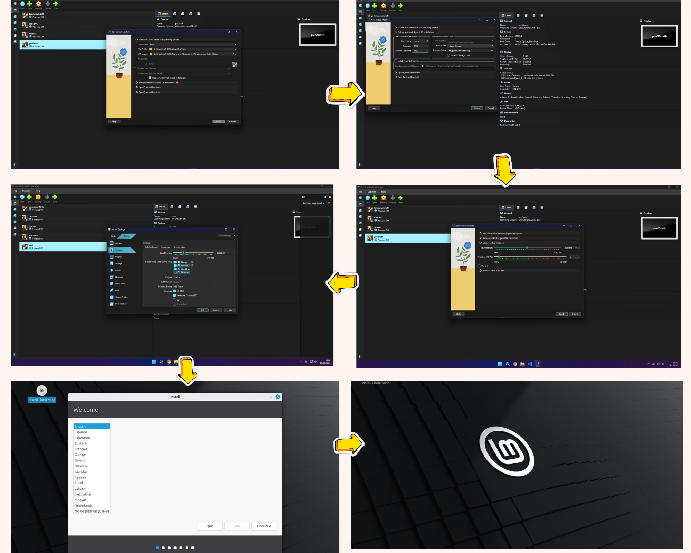
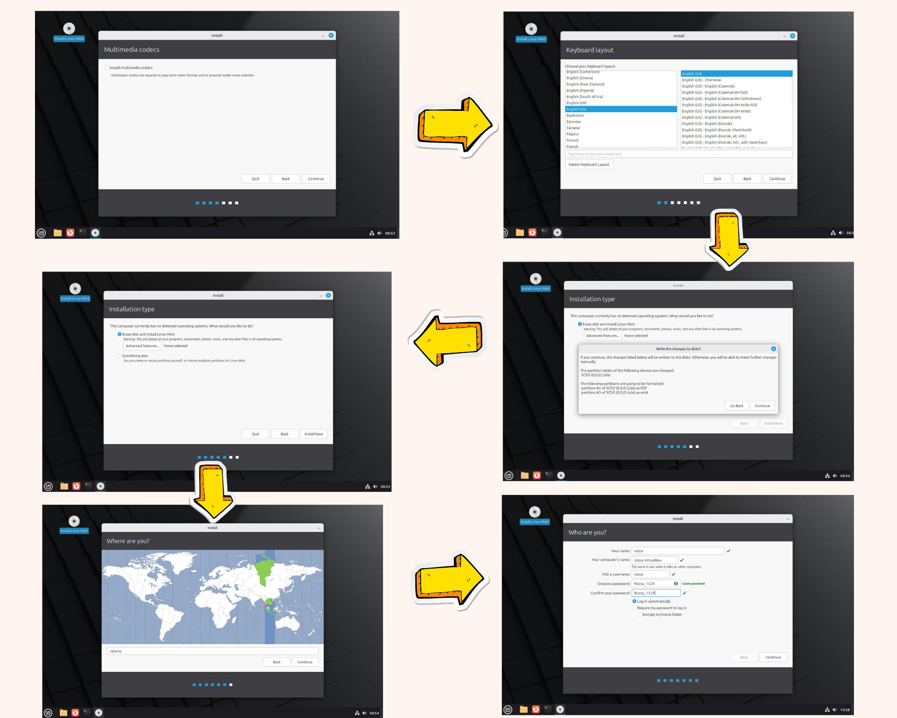
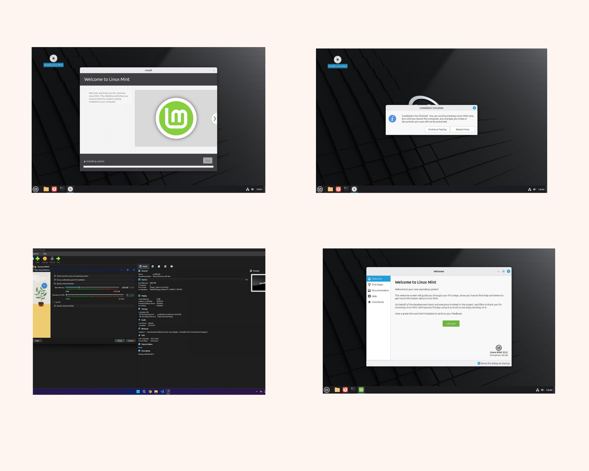
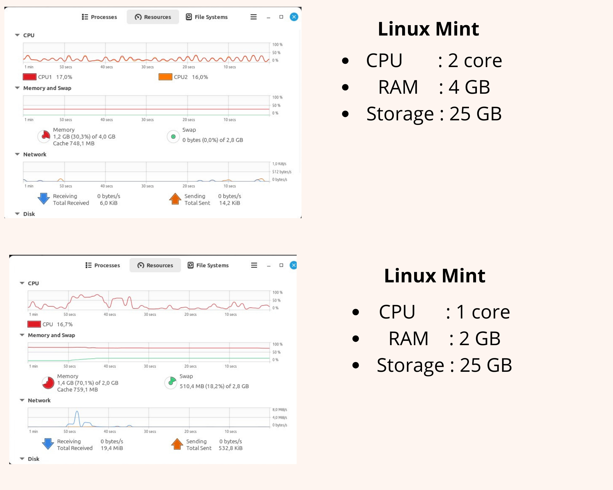

# Laporan Praktikum Minggu 12
Topik: Virtualisasi Menggunakan Virtual Machine  

---

## Identitas
- **Nama**  : Rizzca Anggraeny
- **NIM**   : 250320578 
- **Kelas** : 1DSRA

---
## A. Deskripsi Singkat
Pada praktikum minggu ini, mahasiswa akan mempelajari konsep **virtualisasi sistem operasi** dengan menggunakan **Virtual Machine (VM)**.  
Mahasiswa diarahkan untuk menginstal dan menjalankan sistem operasi guest di atas host OS menggunakan perangkat lunak virtualisasi seperti **VirtualBox** atau **VMware**.

Praktikum ini menekankan pemahaman hubungan antara **host OS**, **guest OS**, dan **hypervisor**, serta bagaimana konfigurasi resource (CPU, memori, dan storage) memengaruhi kinerja dan isolasi sistem.

---

## Tujuan
Setelah menyelesaikan tugas ini, mahasiswa mampu:
1. Menginstal perangkat lunak virtualisasi (VirtualBox/VMware).  
2. Membuat dan menjalankan sistem operasi guest di dalam VM.  
3. Mengatur konfigurasi resource VM (CPU, RAM, storage).  
4. Menjelaskan mekanisme proteksi OS melalui virtualisasi.  
5. Menyusun laporan praktikum instalasi dan konfigurasi VM secara sistematis.

---

## Dasar Teori
1. Virtualisasi adalah teknologi yang memungkinkan satu perangkat keras fisik menjalankan beberapa sistem operasi secara
   bersamaan dengan cara membagi sumber daya secara virtual (Silberschatz et al., 2018).
2. Virtual Machine merupakan komputer virtual yang memiliki sistem operasi sendiri dan berjalan di atas mesin fisik
   menggunakan bantuan perangkat lunak virtualisasi (Tanenbaum & Bos, 2015).
3. Hypervisor adalah perangkat lunak yang bertugas mengelola dan mengatur virtual machine, seperti Oracle VirtualBox yang
   termasuk hypervisor tipe hosted (Type 2) (Oracle, VirtualBox Documentation).
4. Pengelolaan Sumber Daya, virtualisasi memungkinkan pembagian CPU, memori, dan perangkat I/O sehingga setiap virtual
   machine dapat berjalan secara terisolasi dan efisien (Arpaci-Dusseau & Arpaci-Dusseau, OSTEP).
5. Manfaat Virtualisasi, virtualisasi meningkatkan efisiensi penggunaan perangkat keras, memudahkan pengujian sistem,
   serta menjadi dasar dari teknologi cloud computing modern (Silberschatz et al., 2018; OSTEP).

---
## B. Ketentuan Teknis
- Virtualisasi dapat menggunakan **VirtualBox** atau **VMware**.  
- Sistem operasi guest bebas (Linux Ubuntu direkomendasikan).  
- Praktikum dapat dilakukan secara **kelompok kecil (2–3 orang)**.

Struktur folder (sesuaikan dengan template repo):
```
praktikum/week12-virtual-machine/
├─ code/
│  └─ catatan_konfigurasi.txt (opsional)
├─ screenshots/
│  ├─ instalasi_vm.png
│  ├─ konfigurasi_resource.png
│  └─ os_guest_running.png
└─ laporan.md
```

---

## Langkah Praktikum
1. **Instalasi Virtual Machine**
   - Instal VirtualBox atau VMware pada komputer host.  
   - Pastikan fitur virtualisasi (VT-x / AMD-V) aktif di BIOS.

2. **Pembuatan OS Guest**
   - Buat VM baru dan pilih OS guest (misal: Ubuntu Linux).  
   - Atur resource awal:
     - CPU: 1–2 core  
     - RAM: 2–4 GB  
     - Storage: ≥ 20 GB

3. **Instalasi Sistem Operasi**
   - Jalankan proses instalasi OS guest sampai selesai.  
   - Pastikan OS guest dapat login dan berjalan normal.

4. **Konfigurasi Resource**
   - Ubah konfigurasi CPU dan RAM.  
   - Amati perbedaan performa sebelum dan sesudah perubahan resource.

5. **Analisis Proteksi OS**
   - Jelaskan bagaimana VM menyediakan isolasi antara host dan guest.  
   - Kaitkan dengan konsep *sandboxing* dan *hardening* OS.

6. **Dokumentasi**
   - Ambil screenshot setiap tahap penting.  
   - Simpan di folder `screenshots/`.

7. **Commit & Push**
   ```bash
   git add .
   git commit -m "Minggu 12 - Virtual Machine"
   git push origin main
   ```

---

## Hasil Eksekusi
1. **Instalasi Virtual Machine**
   - Instal VirtualBox atau VMware pada komputer host.
     
     
     
     
   - Pastikan fitur virtualisasi (VT-x / AMD-V) aktif di BIOS.
     

2. **Pembuatan OS Guest**
   - Buat VM baru dan pilih OS guest
     

3. **Instalasi Sistem Operasi**
   - Jalankan proses instalasi OS guest sampai selesai.  
   - Pastikan OS guest dapat login dan berjalan normal.
   - Ubah konfigurasi CPU dan RAM.
      
      

4. **Konfigurasi Resource**
   - Amati perbedaan performa sebelum dan sesudah perubahan resource.
      

---

## Analisis
- Jelaskan bagaimana VM menyediakan isolasi antara host dan guest.
- Virtual Machine (VM) menyediakan isolasi antara host dan guest melalui beberapa mekanisme teknis yang diimplementasikan
  oleh hypervisor (seperti VirtualBox).
  - Cara VM Mengisolasi Host dan Guest:
    - Komputer Virtual yang Terpisah
      VM seperti membuat "komputer di dalam komputer". Sistem guest mendapat CPU virtual, RAM virtual (lihat
      `hasil_performa_resource_week12.png`: RAM 2-4 GB), dan penyimpanan virtual (25 GB) yang dialokasikan dari host tapi
      berjalan terpisah.
    - Disk Virtual yang Terisolasi
      Saat instalasi Linux Mint, pilihan "Erase disk and install Linux Mint" hanya
      menghapus disk virtual, bukan disk fisik host.
    - Jaringan Terpisah
      VirtualBox punya fitur VirtualBox Networking (`instalasi_VM_1.png`) yang membuat jaringan virtual, sehingga aktivitas
      online guest tidak mengganggu jaringan host.
    - Sistem File Terpisah
      File di dalam VM disimpan sebagai file container (seperti .vdi) yang tidak bisa diakses langsung dari host tanpa
      konfigurasi khusus.
       
- Kaitkan dengan konsep *sandboxing* dan *hardening* OS.
  Virtual Machine (VM) secara langsung merealisasikan konsep sandboxing dengan berperan sebagai "sandbox" atau lingkungan
  terkurung tingkat sistem operasi.
  - VM sebagai Sandbox Tingkat Sistem Operasi
    Lingkungan Terkurung Lengkap, VM bertindak seperti “kotak pasir” raksasa yang mengisolasi seluruh sistem operasi guest
    beserta semua aplikasinya. Semua aktivitas—termasuk instalasi, konfigurasi, dan eksekusi kode—hanya berlaku di dalam
    VM.
  - Isolasi Penuh dari Host
    Contoh: Saat memilih “Erase disk and install Linux Mint” (instalasi_sistem_operasi_1.png), yang terhapus hanya disk
    virtual, bukan disk fisik host.
  - Kontainmen Risiko
    Jika terjadi infeksi malware, crash sistem, atau kesalahan konfigurasi di guest, dampaknya tidak menyebar ke host
    karena dibatasi oleh hypervisor.

  - VM Memungkinkan Hardening OS yang Aman dan Terukur
    - Hardening Tanpa Risiko ke Host
      Di dalam VM, pengguna dapat menerapkan langkah-langkah keamanan ketat seperti menonaktifkan layanan tidak perlu
      (USB, Bluetooth, SSH dalam instalasi_sistem_operasi_2.png) atau mengaktifkan enkripsi home folder—tanpa takut
      merusak atau mengunci sistem host.
    - Lingkungan Pengujian untuk Kebijakan Keamanan
      VM menyediakan tempat aman untuk menguji konfigurasi keamanan (firewall rules, kebijakan password, dll.) sebelum
      diterapkan di sistem produksi.
      Pemisahan Peran dan Akses
    - Pengguna dalam VM (contoh: username dan password) memiliki hak akses terbatas hanya dalam lingkungan
      virtual, memperkecil risiko eskalasi privilege ke host.

---

## Kesimpulan
1. VM berhasil dibuat sebagai “komputer virtual” yang terpisah dan aman
   Kita berhasil menginstal Linux Mint di dalam VirtualBox, dengan spesifikasi virtual sendiri (2 inti prosesor, 4 GB RAM,
   dan 25 GB penyimpanan). Semua aktivitas di dalam VM mulai dari instalasi sistem sampai menjalankan aplikasi berjalan
   dalam lingkungan yang terisolasi sepenuhnya, tidak mengganggu atau merusak komputer utama (host).
2. VM menggabungkan dua konsep keamanan: isolasi (sandboxing) dan penguatan sistem (hardening)
   VM berperan sebagai **kotak pasir** yang mengurung semua kegiatan guest OS. Di dalamnya, kita bisa **mengamankan sistem
   tamu** dengan cara mematikan fitur tidak perlu (seperti Bluetooth atau USB), mengenkripsi folder, dan menggunakan
   password kuat semua ini dilakukan tanpa takut merusak sistem host. Jadi, VM melindungi host dari guest, dan sekaligus
   memungkinkan kita mengamankan guest dari dalam.
3. VM memberikan solusi praktis untuk uji coba, pengembangan, dan keamanan sehari-hari
   Dari hasil monitoring, VM terbukti stabil dan hemat resource. Kita bisa menjalankan berbagai OS, menguji aplikasi
   (misalnya IDE Java), atau mensimulasikan lingkungan kerja semuanya dalam ruang terisolasi yang aman. Dengan fitur
   snapshot dan manajemen yang mudah, virtualisasi menjadi alat yang sangat berguna baik untuk belajar, bekerja, maupun
   menjaga keamanan sistem.

---

## Quiz
1. Apa perbedaan antara host OS dan guest OS?
- **jawaban:**
   - Host OS adalah sistem operasi utama yang mengelola hardware komputer secara langsung, seperti Windows atau Linux di
     komputer fisik. Guest OS adalah sistem operasi yang berjalan di dalam virtual machine (VM), di atas host OS, dan
     tidak mengakses hardware langsung—ia bergantung pada host untuk sumber daya. Perbedaannya, host mengontrol hardware
     asli, sedangkan guest beroperasi dalam lingkungan virtual yang disimulasikan.
3. Apa peran hypervisor dalam virtualisasi?
- **jawaban:**
   - Hypervisor adalah perangkat lunak yang memungkinkan beberapa sistem operasi (guest OS) berjalan secara bersamaan di
     satu mesin fisik. Ia bertindak sebagai pengelola utama, membagi sumber daya hardware seperti CPU, memori, dan
     penyimpanan ke guest OS, serta memastikan mereka terisolasi dan efisien tanpa saling ganggu.
5. Mengapa virtualisasi meningkatkan keamanan sistem?
- **jawaban:**
   - Virtualisasi meningkatkan keamanan sistem karena mengisolasi setiap sistem operasi atau aplikasi dalam virtual
     machine (VM) terpisah. Jika satu VM terinfeksi malware atau diserang, yang lain tetap aman dan tidak terpengaruh.
     Selain itu, ia memungkinkan snapshot untuk pemulihan cepat dan membatasi akses langsung ke hardware fisik, sehingga
     mengurangi risiko kerusakan luas.
---

## Refleksi Diri
Tuliskan secara singkat:
- Apa bagian yang paling menantang minggu ini?
  - Bagian yang paling menantang adalah memahami konsep virtualisasi dan cara kerja Virtual Machine, terutama saat mencoba
    menjalankan beberapa sistem operasi sekaligus dan memahami pengaturan resource di VirtualBox.
- Bagaimana cara Anda mengatasinya?
  - Saya mengatasinya dengan membaca teori dari buku dan dokumentasi, serta mencoba langsung di VirtualBox, membuat
    percobaan sederhana untuk memahami bagaimana VM menggunakan CPU, memori, dan storage. Praktik langsung membuat konsep
    lebih jelas dan mudah diingat.

---

**Credit:**  
_Template laporan praktikum Sistem Operasi (SO-202501) – Universitas Putra Bangsa_
