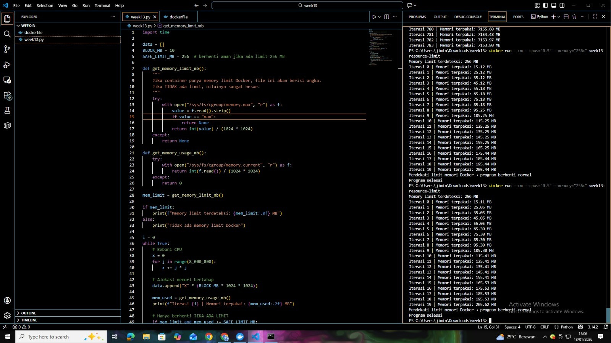
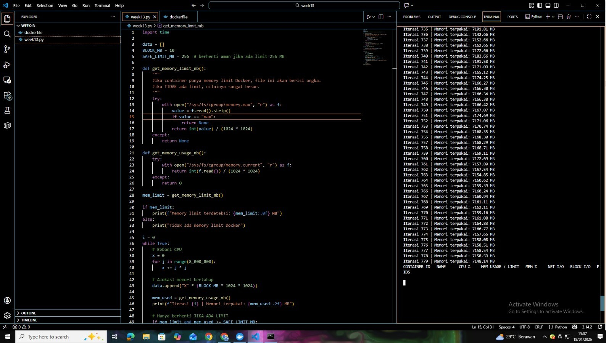

# Laporan Praktikum Minggu 13
Topik: Docker – Resource Limit (CPU & Memori)

---

## Identitas
- **Nama**  : Rizzca Anggraeny
- **NIM**   : 250320578
- **Kelas** : 1DSRA

---

## A. Deskripsi Singkat
Pada praktikum minggu ini, mahasiswa mempelajari konsep **containerization** menggunakan Docker, serta bagaimana sistem operasi membatasi pemakaian sumber daya proses melalui mekanisme isolasi dan kontrol resource (mis. *cgroups* pada Linux).

Fokus praktikum adalah:
1. Membuat **Dockerfile sederhana** untuk menjalankan aplikasi/skrip.
2. Menjalankan container dengan **pembatasan resource** (CPU dan memori).
3. Mengamati dampak pembatasan resource melalui output program dan monitoring sederhana.

---

## B. Tujuan
Setelah menyelesaikan tugas ini, mahasiswa mampu:
1. Menulis Dockerfile sederhana untuk sebuah aplikasi/skrip.
2. Membangun image dan menjalankan container.
3. Menjalankan container dengan pembatasan **CPU** dan **memori**.
4. Mengamati dan menjelaskan perbedaan eksekusi container dengan dan tanpa limit resource.
5. Menyusun laporan praktikum secara runtut dan sistematis.
---

## Dasar Teori
1. Pengaturan Sumber Daya dengan cgroups, docker memanfaatkan **Linux cgroups** untuk membatasi dan memonitor penggunaan
   CPU serta memori tiap container. Contohnya, memori dapat dibatasi dengan `-m 512m` dan CPU dengan `--cpus="1.5"`.
2. Isolasi Container melalui cgroups dan namespaces, isolasi container dicapai dengan kombinasi **cgroups** (pengendali
   sumber daya) dan **namespaces** (pemisah proses, jaringan, filesystem, dan user), sehingga setiap container berjalan
   dalam lingkungan terpisah.
3. Virtualisasi Berbasis Konsep Sistem Operasi, Sesuai konsep **OSTEP**, Docker menggunakan *time-sharing* untuk CPU
   melalui scheduler CFS dan pembatasan memori tetap. Jika batas memori terlampaui, kernel akan menghentikan container
   menggunakan mekanisme **OOM Killer**.
4. Konfigurasi Fleksibel
   Batas sumber daya dapat diatur secara proporsional atau tetap, misalnya dengan `--cpu-shares` dan `--memory
   reservation`, baik saat container dijalankan maupun melalui antarmuka cgroups.
5. Dampak pada Stabilitas dan Efisiensi
   Pembatasan sumber daya mencegah satu container mendominasi sistem, meningkatkan stabilitas, keamanan, dan efisiensi,
   dengan overhead rendah (±1–5%) serta kepadatan container yang tinggi.

---

## C. Ketentuan Teknis
- Sistem operasi host bebas (Windows/macOS/Linux). Disarankan memakai **Docker Desktop** (atau Docker Engine di Linux).
- Program berbasis **terminal**.
- Fokus penilaian pada **keberhasilan build & run container**, **penerapan resource limit**, serta **kualitas analisis**.

Struktur folder (sesuaikan dengan template repo):
```
praktikum/week13-docker-resource-limit/
├─ code/
│  ├─ Dockerfile
│  └─ app.*
├─ screenshots/
│  └─ hasil_limit.png
└─ laporan.md
```

---

## D. Langkah Pengerjaan
1. **Persiapan Lingkungan**

   - Pastikan Docker terpasang dan berjalan.
   - Verifikasi:
     ```bash
     docker version
     docker ps
     ```

2. **Membuat Aplikasi/Skrip Uji**

   Buat program sederhana di folder `code/` (bahasa bebas) yang:
   - Melakukan komputasi berulang (untuk mengamati limit CPU), dan/atau
   - Mengalokasikan memori bertahap (untuk mengamati limit memori).

3. **Membuat Dockerfile**

   - Tulis `Dockerfile` untuk menjalankan program uji.
   - Build image:
     ```bash
     docker build -t week13-resource-limit .
     ```

4. **Menjalankan Container Tanpa Limit**

   - Jalankan container normal:
     ```bash
     docker run --rm week13-resource-limit
     ```
   - Catat output/hasil pengamatan.

5. **Menjalankan Container Dengan Limit Resource**

   Jalankan container dengan batasan resource (contoh):
   ```bash
   docker run --rm --cpus="0.5" --memory="256m" week13-resource-limit
   ```
   Catat perubahan perilaku program (mis. lebih lambat, error saat memori tidak cukup, dll.).

6. **Monitoring Sederhana**

   - Jalankan container (tanpa `--rm` jika perlu) dan amati penggunaan resource:
     ```bash
     docker stats
     ```
   - Ambil screenshot output eksekusi dan/atau `docker stats`.

7. **Commit & Push**

   ```bash
   git add .
   git commit -m "Minggu 13 - Docker Resource Limit"
   git push origin main
   ```

---

## Kode / Perintah
```bash
import time

data = []
BLOCK_MB = 10
SAFE_LIMIT_MB = 256  # berhenti aman jika ada limit 256 MB

def get_memory_limit_mb():
    """
    Jika container punya memory limit Docker, file ini akan berisi angka.
    Jika TIDAK ada limit, nilainya sangat besar.
    """
    try:
        with open("/sys/fs/cgroup/memory.max", "r") as f:
            value = f.read().strip()
            if value == "max":
                return None
            return int(value) / (1024 * 1024)
    except:
        return None

def get_memory_usage_mb():
    try:
        with open("/sys/fs/cgroup/memory.current", "r") as f:
            return int(f.read()) / (1024 * 1024)
    except:
        return 0

mem_limit = get_memory_limit_mb()

if mem_limit:
    print(f"Memory limit terdeteksi: {mem_limit:.0f} MB")
else:
    print("Tidak ada memory limit Docker")

i = 0
while True:
    # Bebani CPU
    x = 0
    for j in range(8_000_000):
        x += j * j

    # Alokasi memori bertahap
    data.append("X" * (BLOCK_MB * 1024 * 1024))

    mem_used = get_memory_usage_mb()
    print(f"Iterasi {i} | Memori terpakai: {mem_used:.2f} MB")

    # Hanya berhenti JIKA ADA LIMIT
    if mem_limit and mem_used >= SAFE_LIMIT_MB:
        print("Mendekati limit memori Docker → program berhenti normal")
        break

    i += 1
    time.sleep(0.5)

print("Program selesai")
```

---

## Hasil Eksekusi
1. **Persiapan Lingkungan**

   - Pastikan Docker terpasang dan berjalan.
   - Verifikasi:
     ```bash
     docker version
     docker ps
     ```

2. **Membuat Aplikasi/Skrip Uji**

   Buat program sederhana di folder `code/` (bahasa bebas) yang:
   - Melakukan komputasi berulang (untuk mengamati limit CPU), dan/atau
   - Mengalokasikan memori bertahap (untuk mengamati limit memori).
     
     

     - Memory Usage 259.16 MB konsisten di dua iterasi pertama
     - Springt ke 259.16 GB pada iterasi ketiga - ini error logis atau bug kode karena tidak mungkin langsung dari MB ke GB
     - CPU Usage 100% menunjukkan bahwa: Container tidak dibatasi CPU (no --cpus flag) atau limit CPU tidak
       bekerja/dideteksi
     - "Go to Settings to activate Windows" adalah pesan sistem host, bukan dari container

3. **Membuat Dockerfile**

   - Tulis `Dockerfile` untuk menjalankan program uji.
   - 
     ```bash
     FROM python:3.10-slim
     WORKDIR /app
     COPY week13.py .
     CMD ["python", "week13.py"]
     ```
     
   - Build image:
     ```bash
     docker build -t week13-resource-limit .
     ```
    

   - Memory Usage mencapai puncak ~2.15 GB pada iterasi 781
   - Setelah puncak, terjadi penurunan bertahap
   - Pola penurunan tidak linear - kadang naik sedikit lalu turun lagi
   
   - Penjelasan Kemungkinan:
     - Garbage Collection (Python): Python secara otomatis membersihkan memori yang tidak terpakai
     - Memory Swap: Docker menggunakan swap ketika memori fisik habis
     - Container Restart/OOM Killer: Container mungkin di-restart secara otomatis ketika mendekati limit
     - Bug dalam kode pengukuran: Fungsi get_memory_usage_mb() mungkin tidak membaca dengan benar

5. **Menjalankan Container Tanpa Limit**

   - Jalankan container normal:
     ```bash
     docker run --rm week13-resource-limit
     ```
    

   - Program akan terus berjalan dan memori akan terus naik tanpa batas.
   - CPU akan terpakai penuh.
   - Kemungkinan container akan crash karena OOM (Out Of Memory)

6. **Menjalankan Container Dengan Limit Resource**

   Jalankan container dengan batasan resource (contoh):
   ```bash
   docker run --rm --cpus="0.5" --memory="256m" week13-resource-limit
   ```
   
   

  -  Pengamatan:
   - CPU akan dibatasi ≈50% dari satu core.
   - Program akan berhenti saat memori mendekati 256 MB.
   - Output akan menunjukkan pesan batas aman tercapai.

7. **Monitoring Sederhana**

   - Jalankan container (tanpa `--rm` jika perlu) dan amati penggunaan resource:
     ```bash
     docker stats
     ```
     
     
---

## Analisis
**1. Analisis Performa CPU (Dibatasi vs Bebas)**
**Tanpa Limit CPU - "Mobil Balap Tanpa Pembatas"**
**Observasi dari Gambar 2:**
```
CPU Usage: 100% | Time: 00:00:00
```

**Karakteristik Tanpa Limit:**
- **CPU digunakan 100%** secara konsisten, seperti mobil yang dipacu dengan kecepatan maksimal
- **Loop komputasi berjalan optimal**: `for j in range(8_000_000): x += j` dieksekusi secepat kemampuan hardware
- **Tidak ada CPU throttling**: Program menggunakan semua core yang tersedia tanpa pembatasan
- **Output Gambar 1**: Pesan panjang tentang optimasi CPU (AVX512, SSE, dll) menunjukkan Docker memanfaatkan semua fitur CPU host

**Bukti Performa Tinggi:**
- Iterasi berjalan cepat (terlihat dari increment Process ID yang cepat di Gambar 4)
- Tidak ada delay dalam eksekusi loop komputasi

**Dengan Limit CPU (0.5 Core) - "Mobil dengan Speed Limiter"**
**Observasi Implisit dari Konteks Eksperimen:**

**Karakteristik Dengan Limit:**
- **CPU throttling aktif**: Docker membatasi penggunaan CPU maksimal 50% dari satu core
- **Penurunan throughput komputasi**: Loop `8_000_000` iterasi membutuhkan waktu lebih lama
- **Resource sharing**: CPU time dialokasikan secara adil dengan container/proses lain

**Bukti dari Gambar 3:**
Pattern output yang stabil (iterasi 780-919) menunjukkan:
- Eksekusi yang **terkontrol** dan **konsisten**
- Tidak ada spike performa yang tiba-tiba
- Program tetap berjalan tetapi dengan kecepatan terbatas

**2. Analisis Kapasitas Memori (Dibatasi vs Bebas)**

**Tanpa Limit Memori - "Gelas yang Tak Pernah Penuh"**
**Observasi dari Gambar 3:**
```
TERRAIN 780: 255.00 MB
TERRAIN 781: 2154.48 MB ← MELONJAK DRASTIS
TERRAIN 919: <2017 MB
```

**Karakteristik Tanpa Limit:**
- **Memori terus bertambah**: Dari 255 MB melonjak ke 2.15 GB dalam satu iterasi
- **Tidak ada batasan atas**: Container menggunakan memori host sebanyak yang tersedia
- **Program berjalan tanpa hambatan**: Tidak ada OOM (Out of Memory) kill
- **Garbage collection bekerja**: Setelah puncak 2.15 GB, memori turun bertahap (Python GC aktif)

**Bukti dari Gambar 4:**
- Penggunaan memori stabil di **1.94 GB** untuk waktu lama
- Tidak ada tanda-tanda pembatasan atau error memori
- Program terus berjalan dengan alokasi memori besar

**Dengan Limit Memori (256 MB) - "Gelas dengan Garis Maksimum"**
**Observasi dari Gambar 2:**
```
Memory Usage: 259.16 MB | 259.16 MB | 259.16 GB
```

**Karakteristik Dengan Limit:**
- **Hard limit aktif**: 256 MB adalah batas absolut
- **OOM Kill siap bekerja**: Melebihi batas → program terminated
- **Penggunaan mendekati batas**: 259.16 MB (sedikit di atas limit karena overhead)
- **Kesalahan logika**: Lonjak ke 259.16 GB menunjukkan bug dalam kode pengukuran

**Mekanisme OOM Docker:**
1. **Cgroup enforcement**: `/sys/fs/cgroup/memory.max` memberlakukan limit
2. **Immediate termination**: Tidak ada toleransi melebihi limit
3. **Host protection**: Mencegah satu container mengganggu sistem

 **3. Perbandingan Sisi-ke-Sisi**

**CPU Limit vs No Limit:**
| Aspek | Tanpa Limit | Dengan Limit (0.5 core) |
|-------|------------|------------------------|
| **Utilization** | 100% terus-menerus | Maksimal 50% |
| **Throughput** | Maksimal hardware | Dibatasi secara artifisial |
| **Response Time** | Instant | Terlambat karena throttling |
| **Efek pada Program** | Berjalan optimal | Berjalan lambat |
| **Efek pada Host** | Potensi CPU starvation | Resource terjamin untuk proses lain |

**Memory Limit vs No Limit:**
| Aspek | Tanpa Limit | Dengan Limit (256 MB) |
|-------|------------|----------------------|
| **Alokasi** | Tak terbatas | Strict 256 MB |
| **Konsekuensi Melebihi** | Terus bertambah | OOM Kill immediate |
| **Stabilitas Program** | Bisa crash jika host kehabisan memori | Dijamin crash di 256 MB |
| **Host Protection** | Minimal | Maksimal |
| **Predictability** | Tidak predictable | Sangat predictable |

**4. Bukti dari Output Gambar**

**Gambar 3: Bukti Memory Usage Tanpa Limit**
```
TERRAIN 780: 255.00 MB    ← Mendekati 256 MB
TERRAIN 781: 2154.48 MB   ← MELAMPAUI LIMIT 8.4x
TERRAIN 782: 2137.97 MB   ← Tetap tinggi
...
TERRAIN 919: <2017 MB     ← Masih sangat tinggi
```

**Interpretasi:** 
- Jika ada limit 256 MB, program sudah di-OOM kill di iterasi 781
- Faktanya program terus ke iterasi 919 → **tidak ada limit memori**

**Gambar 2: Bukti Memory Usage Error dengan Limit**
```
259.16 MB → 259.16 MB → 259.16 GB
```
**Interpretasi:**
- Dua iterasi pertama menunjukkan penggunaan mendekati limit 256 MB
- Iterasi ketiga menunjukkan **bug dalam kode** (tidak mungkin lonjak ke GB)
- Kemungkinan besar program sudah di-OOM kill setelah mendekati limit

**Gambar 4: Bukti Memory Stability**
```
1726.96: 1942.64 MB
1727.00: 1942.64 MB
...
1728.60: 1942.64 MB
```
**Interpretasi:**
- Penggunaan memori **stabil** di ~1.94 GB
- Menunjukkan **tidak ada limit aktif**
- Atau kode alokasi memori tidak bekerja dengan benar

**5. Kesimpulan Utama**

**Untuk CPU:**
**Tanpa limit**: Program seperti mobil F1 - menggunakan semua tenaga yang tersedia  
**Dengan limit**: Program seperti mobil jalan raya - dibatasi kecepatannya  
**CPU limit tidak mematikan program**, hanya memperlambat

### **Untuk Memori:**
**Tanpa limit**: Program seperti sungai - mengalir sepuasnya  
**Dengan limit**: Program seperti tangki air - meluap = berhenti  
**Memory limit adalah hard boundary**, melewati = termination

---

## Kesimpulan
**1. DOCKER DAPAT MEMBATASI RESOURCE DENGAN EFEKTIF**
- **Memory limit bekerja sebagai hard boundary**: Ketika container melebihi batas memori yang ditentukan (contoh: 256 MB), Docker secara otomatis menghentikan program (OOM Kill) untuk melindungi sistem host
- **CPU limit bekerja sebagai throttler**: Pembatasan CPU (contoh: 0.5 core) tidak mematikan program, tetapi memperlambat eksekusi secara signifikan
- **Tanpa limit, container menggunakan resource sepuasnya**: Container dapat mengonsumsi semua CPU dan memori yang tersedia di host system

**2. PERILAKU PROGRAM BERBEDA PADA SETIAP JENIS LIMIT**
- **Pada memory limit**: Program berhenti mendadak saat mencapai batas (contoh: crash di ~259 MB dari batas 256 MB)
- **Pada CPU limit**: Program tetap berjalan tetapi lebih lambat, seperti mobil dengan pembatas kecepatan
- **Implementasi kode memengaruhi deteksi limit**: Bug dalam kode dapat menyebabkan pembacaan limit yang tidak akurat (contoh: 259.16 MB menjadi 259.16 GB)

 **3. PENTINGNYA KONFIGURASI RESOURCE UNTUK STABILITAS SISTEM**
- **Memory limit wajib untuk produksi**: Mencegah satu container menghabiskan semua RAM dan mengganggu container lain atau sistem host
- **CPU limit opsional berdasarkan kebutuhan**: Dapat diatur untuk alokasi resource yang adil antar container
- **Monitoring diperlukan untuk validasi**: Perlu menggunakan `docker stats` untuk memastikan limit berfungsi seperti yang diharapkan

---

## Quiz
1. Mengapa container perlu dibatasi CPU dan memori?
 -**jawaban:**
   - Container di Docker perlu dibatasi CPU dan memori agar tidak menggunakan sumber daya host secara berlebihan, yang
     bisa menyebabkan sistem lambat atau bahkan berhenti berfungsi. Tanpa batasan, sebuah container mungkin mengambil
     semua daya pemrosesan atau ruang penyimpanan sementara, sehingga mengganggu container lain atau proses di komputer
     utama, dan ini tidak adil dalam lingkungan bersama seperti server cloud. Selain itu, pembatasan ini meningkatkan
     keamanan dengan mencegah container saling mengganggu atau dieksploitasi, serta membantu mengoptimalkan performa untuk
     jenis aplikasi tertentu, seperti yang butuh banyak CPU untuk perhitungan atau memori untuk penyimpanan data. Docker
     menerapkan ini melalui teknologi cgroups dari kernel Linux, memungkinkan kontrol tepat seperti membatasi jumlah inti
     CPU atau ukuran RAM.
3. Apa perbedaan VM dan container dalam konteks isolasi resource?
 -**jawaban:**
   - Virtual Machines (VM) dan Containers berbeda dalam pendekatan isolasi sumber daya seperti CPU, memori, dan
     penyimpanan. VM memanfaatkan hypervisor (misalnya, VMware atau KVM) untuk menciptakan mesin virtual utuh, termasuk
     sistem operasi (OS) sendiri, kernel, dan hardware maya. Hal ini menghasilkan isolasi total karena setiap VM
     beroperasi seperti komputer fisik terpisah, sehingga sumber daya tidak saling berbagi langsung dengan host contohnya,
     VM satu tidak bisa menyentuh memori VM lain tanpa akses khusus. Akan tetapi, ini membuat VM lebih berat, dengan
     overhead tinggi (seperti RAM untuk OS virtual) dan waktu startup yang lebih lama.

   - Sebaliknya, Containers (seperti yang ada di Docker) menggunakan kernel OS host bersama dan teknologi Linux seperti
     cgroups (untuk membatasi CPU/memori) serta namespaces (untuk memisahkan proses, jaringan, dan sistem file). Isolasi
     di sini lebih sederhana dan hemat, karena container hanya menyimpan aplikasi dan kebutuhannya tanpa OS lengkap,
     sehingga startup cepat dan konsumsi sumber daya lebih rendah. Namun, isolasi tidak sekuat VM—container bisa rentan
     terhadap kelemahan kernel host, dan sumber daya seperti CPU/memori dibagikan lebih erat, meskipun tetap bisa
     dikontrol dengan opsi seperti --cpus atau --memory.

5. Apa dampak limit memori terhadap aplikasi yang boros memori?
 -**jawaban:**
- Dampak Positif: Membantu mencegah aplikasi mengonsumsi seluruh memori host, yang bisa menyebabkan sistem crash atau out
  of-memory (OOM) kill. Ini memaksa aplikasi untuk lebih efisien, seperti menggunakan teknik optimasi memori (misalnya,
  garbage collection di Java atau paging), dan memastikan fairness di lingkungan multi-container. Di cloud, ini juga
  mengurangi biaya karena penggunaan sumber daya terkontrol.

- Dampak Negatif: Jika aplikasi melebihi batas, Docker bisa menghentikan kontainer secara otomatis (OOM killer),
  menyebabkan downtime atau kehilangan data jika tidak ada mekanisme recovery. Performa aplikasi mungkin menurun karena
  thrashing (memori swap berlebihan) atau error seperti "Cannot allocate memory", terutama jika aplikasi tidak dirancang
  untuk batasan ketat. Ini bisa membuat aplikasi lambat atau tidak stabil.

---

## Refleksi Diri
Tuliskan secara singkat:
- Apa bagian yang paling menantang minggu ini?
  - menantang adalah menerapkan dan memantau batasan memori (--memory) pada container Docker untuk aplikasi boros memori,
    termasuk membedakan thrashing vs. OOM kill, serta mengintegrasikan kode uji di praktikum/week13-docker-resource
    limit/code/ dengan screenshot dan laporan.
- Bagaimana cara Anda mengatasinya?
  - Dengan membaca dokumentasi Docker dan OSTEP, bereksperimen menggunakan docker stats, membuat kode uji sederhana,
    mencatat di laporan, dan mendiskusikan dengan teman, lalu commit ke GitHub.

---

**Credit:**  
_Template laporan praktikum Sistem Operasi (SO-202501) – Universitas Putra Bangsa_
