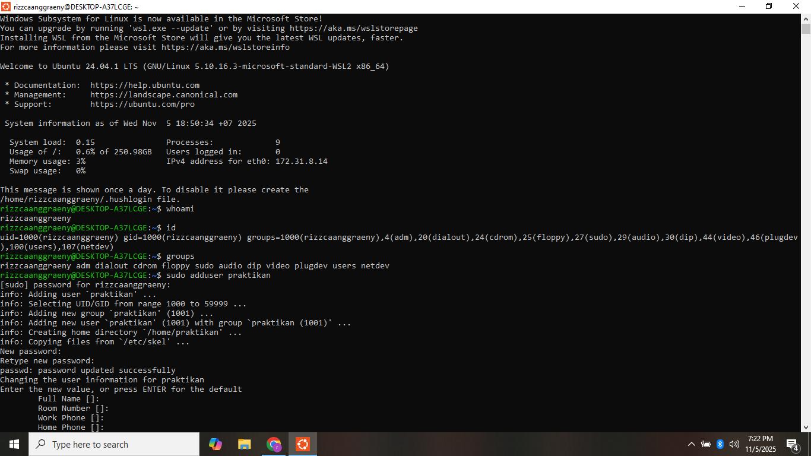
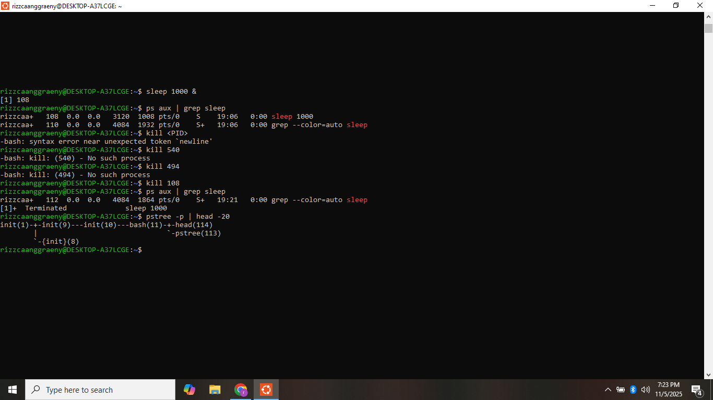

# Laporan Praktikum Minggu IV
## Topik: Manajemen Proses dan User di Linux

---

## Identitas
- **Nama**  :**Rizzca Anggraeny**
- **NIM**   : **250320578**
- **Kelas** : **1DSRA**

---

## Tujuan
Tuliskan tujuan praktikum minggu ini.  
Setelah menyelesaikan tugas ini, mahasiswa mampu:

- Menjelaskan konsep proses dan user dalam sistem operasi Linux.
- Menampilkan daftar proses yang sedang berjalan dan statusnya.
- Menggunakan perintah untuk membuat dan mengelola user.
- Menghentikan atau mengontrol proses tertentu menggunakan PID.
- Menjelaskan kaitan antara manajemen user dan keamanan sistem.

---

## Dasar Teori
1. Konsep proses dalam linux, proses adalah program yang sedang berjalan di sistem operasi
2. Jenis dan status proses di linux
3. Manajemen proses dengan perintah linux dengan perintah seperti ps, pstree, kill <PID>, ps aux | grep
4. Konsep user dan group, Linux adalah sistem multiuser, sehingga dapat digunakan oleh banyak pengguna secara bersamaan. Group digunakan untuk mengelompokkan user guna mengatur hak akses dan keamanan file.
5. Manajemen User dan Hak Akses, Perintah seperti useradd, passwd, userdel, groupadd, dan usermod digunakan untuk mengatur user dan group.

---

## Langkah Praktikum
**1. Setup Environment**
- Gunakan Linux (Ubuntu/WSL).
- Pastikan Anda sudah login sebagai user non-root.
- Siapkan folder kerja :
  ```bash
  praktikum/week4-proses-user/
  ```
**2. Eksperimen 1 – Identitas User Jalankan perintah berikut:**
```bash
whoami
id
groups
```
- Buat user baru (jika memiliki izin sudo)
  ```bash
  sudo adduser praktikan
  sudo passwd praktikan
  ```
- Uji login ke user baru.
**3. Eksperimen 2 – Monitoring Proses Jalankan:**
  ```bash
  ps aux | head -10
  top -n 1
  ```
  - Jelaskan kolom penting seperti PID, USER, %CPU, %MEM, COMMAND
  - Simpan tangkapan layar top ke:
    ```bash
    praktikum/week4-proses-user/screenshots/top.png
    ```
 **4. Eksperimen 3 – Kontrol Proses**
  - Jalankan program latar belakang
    ```bash
    sleep 1000 &
    ps aux | grep sleep
    ```
    - Catat PID proses `sleep`.
    - Hentikan Proses:
      ```bash
      kill <PID>
      ```
    - Pastikan proses telah berhenti dengan `ps aux | grep sleep`.
      
**5. Eksperimen 4 – Analisis Hierarki Proses Jalankan:**
```bash
pstree -p | head -20
```
- Amati hierarki proses dan identifikasi proses induk (init/systemd).
- Catat hasilnya dalam laporan.
**6.Commit & Push**
  ```bash
  git add .
  git commit -m "Minggu 4 - Manajemen Proses & User"
  git push origin main
  ```
      

---

## Kode / Perintah
Tuliskan potongan kode atau perintah utama:
```bash
- whoami
  id
  groups
```
```bash
- sudo adduser praktikan
  sudo passwd praktikan
```
```bash
- ps aux | head -10
  top -n 1
```
```bash
- sleep 1000 &
  ps aux | grep sleep
```
```bash
- kill <PID>
```
```bash
- pstree -p | head -20
```

---

## Hasil Eksekusi
Sertakan screenshot hasil percobaan atau diagram:




---

## Analisis
**Eksperimen 1- Identitas User Jalankan perintah berikut:**
```bash
whoami
id
groups
```
- Perintah `whoami`
  - Fungsi: Menampilkan nama user yang sedang login/aktif pada terminal.
  - Output yang terlihat: `rizzaacanggraeny`
  - Penjelasan: Artinya user yang sedang login ke sistem Linux ini bernama rizzcaaanggraeny.
- Perintah id
  - Fungsi: Menampilkan informasi identitas user lengkap, termasuk:
    - UID (User ID)
    - GID (Group ID)
    - Groups tempat user tersebut tergabung
  - Output kamu:
    - uid=1000(rizzaacanggraeny)
    - gid=1000(rizzaacanggraeny)
    - groups=1000(...),4(adm),20(dialout),24(cdrom),25(floppy),27(sudo),29(audio),30(dip),44(video),46(plugdev),...
  - Penjelasan :
    |Bagian Output                |Arti                                                 |
    |-----------------------------|-----------------------------------------------------|
    |uid=1000(rizzaacanggraeny)   |User ID kamu = 1000 (default user pertama di Linux)  |
    |gid=1000(rizzaacanggraeny)	  |Group utama kamu = 1000 (nama group sama dgn user)   |
    |groups=...	                  |Daftar grup lain yang kamu ikuti                     |
    
  -Perintah groups
   - Fungsi: Menampilkan daftar grup yang dimiliki user aktif saat ini.
   - Output: rizzaacanggraeny adm dialout cdrom floppy sudo audio dip video plugdev users netdev
   - Penjelasan: Ini daftar grup yang kita punya hak akses-nya, lebih ringkas daripada id
     
     |Grup	      |Fungsi                         |
     |----------|---------------------------------|
     |sudo	    |Bisa menjalankan perintah admin  |
     |adm	      |Bisa baca log sistem             |
     |dialout	  |Akses modem / serial ports       |
     |cdrom	    |Akses CD/DVD                     |
     |audio	    |Akses sound system               |
     |video	    |Akses kamera/video               |
     |plugdev	  |Akses perangkat USB              |
     |netdev	  |Izin kelola network device       |
     
  - Perintah sudo adduser praktikan digunakan untuk menambahkan user bernama praktikan
    |Output	           |Makna	Fungsi                                                                                  |
    |------------------|----------------------------------------------------------------------------------------------|
    |sudo	             |Menjalankan perintah dengan hak akses administrator	Memungkinkan user biasa (rizzcaanggraeny) menjalankan
    |                  |perintah yang memerlukan izin root.|
    |adduser praktikan |Menambahkan pengguna baru bernama praktikan	Membuat akun baru di sistem Linux lengkap dengan home directory dan
    |                  |pengaturan awal.|
    |[sudo] password for rizzcaanggraeny:	|Permintaan kata sandi pengguna	Sistem meminta password rizzcaanggraeny untuk memastikan ia berhak         |                  |menjalankan perintah sebagai admin.|
    
  - Perintah sudo passwd praktikan berfungsi untuk mengubah atau menetapkan password baru bagi akun praktikan
    |Baris Output                         | Fungsi                                                                          |
    |-------------------------------------|---------------------------------------------------------------------------------|
    |sudo                                 |Memungkinkan user (rizzcaanggraeny) mengubah password milik user lain (praktikan)|
    |passwd praktikan                     |Digunakan untuk menetapkan kata sandi baru pada akun tersebut                    |        
    |retype password:                     |Sistem meminta password baru yang mengulang kembali password yang diinputkan     |
    |passwd : password                    | Password berhasil diperbarui, menandakan pergantian kata sandi tanpa error      |
    |update successfully

  **3. Eksperimen 2 – Monitoring Proses Jalankan:**
  ```bash
  ps aux | head -10
  top -n 1
  ```
  - Jelaskan kolom penting seperti PID, USER, %CPU, %MEM, COMMAND
    |Kolom       |Keterangan                                                                                                       |
    |------------|-----------------------------------------------------------------------------------------------------------------|
    |PID	       |Nomor unik proses, misal 1, 10, 11, 107 yang menunjukkan masing-masing proses yang sedang berjalan               |
    |USER	       |Pemilik proses, contoh pada gambar: root dan rizzca+ (user biasa)                                                |
    |%CPU	       |Persentase penggunaan CPU tiap proses. Di gambar nilainya kecil (0.0% – 0.2%), berarti proses tidak membebani CPU|
    |%MEM	       |Persentase penggunaan memori oleh proses. Di gambar sangat kecil (0.0% – 0.2%), artinya penggunaan RAM ringan    |
    |COMMAND	   |Nama program/proses yang berjalan seperti init, bash, ps, head, dan top                                          |

  **4. Eksperimen 3 – Kontrol Proses**
  - Catat PID proses `sleep`
    ```bash
    sleep 1000 &
    ps aux | grep sleep
    ```
  - Catat PID proses sleep
    ```bash
    rizzca+   108  0.0  0.0  3120  1008  pts/0  S  19:06  0:00  sleep 1000
    rizzca+   110  0.0  0.0  4084  1932  pts/0  S+ 10:06  0:00  greep --color=auto sleep
    ```
  - Hentikan Proses
    `kill 108`
    108 = PID dari proses sleep
    S+ = status sleping (proses sedang idle)
  - Pastikan proses telah berhenti dengan `ps aux | grep sleep`.
    output:
    ```bash
    rizzca+  112  0.0  0.0  4084  1864  pts/0  S+  19:21 0.0  grep  --color=auto sleep
    [1]+ Terminated             sleep  1000
    ```
  **5. Eksperimen 4 – Analisis Hierarki Proses Jalankan:**
```bash
pstree -p | head -20
```
- Amati hierarki proses dan identifikasi proses induk (init/systemd).
- Catat hasilnya dalam laporan.
```bash
init(1)-+-init(9)---init(10)---bash(11)-+-head(114)
        |                               `-pstree(113)
        `-{init}(8)
```
- Proses paling atas adalah init dengan PID 1, ini menandakan bahwa init (atau systemd) adalah proses induk utama dalam sistem Linux yang
  memulai seluruh proses lain setelah booting.
  PID 1 = proses induk / root of all processes

  |Proses	        |PID	   |Keterangan                                                              |
  |---------------|--------|------------------------------------------------------------------------|
  |init / systemd	|1	     |Proses pertama yang berjalan di sistem Linux (parent dari semua proses) |
  |init	          |9	     |Proses turunan dari init(1)                                             |
  |init	          |10	     |Turunan berikutnya dalam hierarki                                       |
  |bash	          |11	     |Shell yang digunakan user                                               |
  |head	          |114	   |Perintah head -20 yang sedang dijalankan pada terminal                  |

- Berdasarkan hasil pengamatan, proses tertinggi dalam hierarki adalah init (PID 1) yang bertindak sebagai proses induk utama di sistem
  Linux. Semua proses pengguna, termasuk bash, head, dan sleep, merupakan turunan dari proses ini.

---
**Tugas**
1. Dokumentasikan hasil semua perintah dan jelaskan fungsi tiap perintah.
   Eksperimen 1 – Identitas User Jalankan perintah berikut:**
   ```bash
   whoami
   id
   groups
   ```
   - whoami menampilkan user yang sedang login, gunanya untuk mengecek user yang sedang aktif dan dalam mode root atau user biasa
   - id menampilkan informasi identitas pengguna secara lengkap seperti : UID,GID,Grup
   - groups menampilkan grup yang diikuti user

Eksperimen 2
   ```bash
  ps aux | head -10
  top -n 1
  ```
  - ps aux | head -10 digunakan untuk melihat proses-proses yang sedang berjalan di sistem, namun hanya menampilkan 10 proses pertama         saja secara ringkas.
  - top -n 1 menampilkan informasi pemakaian CPU,RAM dan proses yang aktif, mirip seperti membuka task manager tetapi hanya ditampilkan       satu kali kemudian langsung keluar, biasanya top berjalan terus-menerus, namun dengan -n 1 sistem hanya menampilkan sekali saja.
  Eksperimen 3
    ```bash
    sleep 1000 &
    ps aux | grep sleep
    kill 108
    ```
    - sleep 1000 & menjalankan proses sleep selama 1000 detik di latar belakang, sehingga terminal tetap bisa digunakan untuk menjalankan
      perintah. 
    - ps aux | grep sleep menampilkan semua proses yang sedang berjalan, kemudian menyaring proses yang mengandung kata sleep untuk             memastikan proses tersebut masih aktif.
    - kill 108
      - kill mengirimkan sinyal ke proses secara default mengirim sinyal `SIGTERM` untuk meminta proses berhenti dengan aman
      - 108 nomor PID dari proses yang ingin dihentikan. 

3. Gambarkan hierarki proses dalam bentuk diagram pohon (pstree) di laporan.
   ```bash
    init(1)-+-init(9)---init(10)---bash(11)-+-head(114)
        |                               `-pstree(113)
        `-{init}(8)
   ```
5. Jelaskan hubungan antara user management dan keamanan sistem Linux.
   Pengelolaan user memiliki peran besar dalam menjaga keamanan pada sistem Linux. Melalui pengaturan akun pengguna, grup, dan izin
   akses, sistem dapat mengontrol siapa saja yang boleh melihat, menggunakan, atau memodifikasi file dan konfigurasi sistem. Setiap user
   diberikan tingkat akses yang berbeda sehingga hanya pengguna yang memiliki hak tertentu yang dapat melakukan tugas tertentu. Dengan
   melakukan manajemen user secara tepat, seperti memberikan akses sesuai kebutuhan, menggunakan kata sandi yang kuat, serta menempatkan
   user dalam grup yang tepat, sistem dapat terhindar dari penyalahgunaan akses, tindakan tidak sah, dan potensi ancaman keamanan. Dengan
   demikian, pengaturan user yang baik menjadi faktor penting untuk menjaga keamanan dan kestabilan sistem Linux.
7. Upload laporan ke repositori Git tepat waktu.


## Kesimpulan
1. Dari praktikum ini, dipahami bahwa pengaturan pengguna di Linux sangat penting untuk membatasi serta mengatur hak akses, sehingga
   hanya user yang memiliki izin yang bisa menjalankan fungsi tertentu dalam sistem.
3. Pada bagian manajemen proses, praktikum membantu memahami cara melihat, mengendalikan, dan menghentikan proses yang sedang aktif agar
   sistem tetap berjalan lancar dan tidak terganggu.
5. Melalui penggunaan perintah seperti ps, top, kill, whoami, id, dan groups, kita dapat mengetahui informasi pengguna, memantau proses
   yang berjalan, dan mengatur akses serta aktivitas sistem dengan lebih mudah dan teratur.

---

## Quiz
1. Apa fungsi dari proses init atau systemd dalam sistem Linux?
   jawaban :
   - *Menyiapkan Sistem*: Setelah kernel (inti sistem) selesai loading, init (atau systemd) baca pengaturan dari file seperti /etc/inittab
    (untuk yang lama) atau file unit di systemd. Ini buat sistem siap pakai, misalnya dengan menghubungkan hard drive, atur jaringan, dan
    nyalakan komponen hardware.
   - *Mengatur Proses Lain*: init jadi "induk" dari semua program yang berjalan. Kalau ada program anak yang berhenti, init tangani agar
     tidak ada "zombie" (proses mati yang masih ada). Systemd lebih maju, bisa atur urutan startup layanan, catat log, dan perbaiki
     masalah otomatis.
   - *Mengontrol Layanan*: init nyalakan dan matikan program latar belakang seperti server web atau database. Systemd tambah fitur cepat,
     seperti nyalakan banyak layanan sekaligus, dan pakai perintah seperti systemctl start apache2 untuk kendali mudah.
3. Apa perbedaan antara kill dan killall?
   jawaban:
   - Input yang Dibutuhkan: kill butuh PID (nomor unik proses), sedangkan killall butuh nama proses.
   - Jumlah Proses: kill biasanya untuk satu proses, killall bisa hentikan banyak sekaligus.
   - Risiko: killall lebih berisiko kalau nama proses umum (misalnya, "bash" bisa hentikan terminal kamu sendiri). kill lebih presisi.
5. Mengapa user root memiliki hak istimewa di sistem Linux?
   jawaban : User root memiliki hak istimewa di Linux karena ia adalah administrator sistem yang bertanggung jawab mengelola seluruh
   konfigurasi, file, dan proses. Root mendapat akses penuh agar bisa memelihara dan mengontrol sistem, termasuk menginstal software,
   mengatur user, dan mengedit file sistem.

---

## Refleksi Diri
Tuliskan secara singkat:
- Apa bagian yang paling menantang minggu ini?
  bagian menantang minggu ini yaitu mengidentifikasi mana yang merupakan PID dan memahami perintah managemen proses seperti ps, kill dan    sysremd.
- Bagaimana cara Anda mengatasinya?
  dengan mencari referensi yang ada di github dan mencari referensi dari web lain serta mencoba dan menganalisis praktikum.

---

**Credit:**  
_Template laporan praktikum Sistem Operasi (SO-202501) – Universitas Putra Bangsa_
