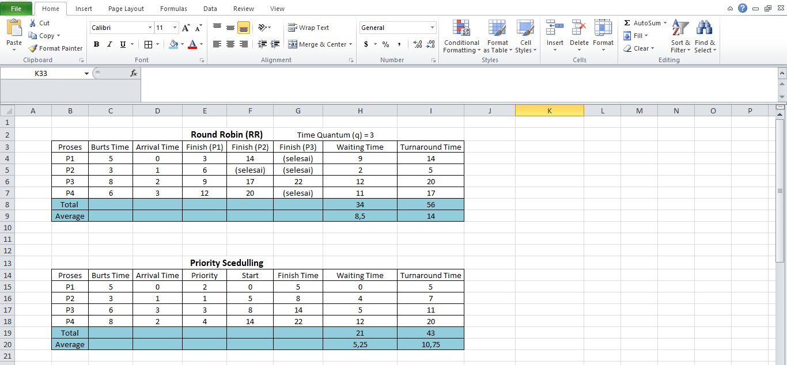
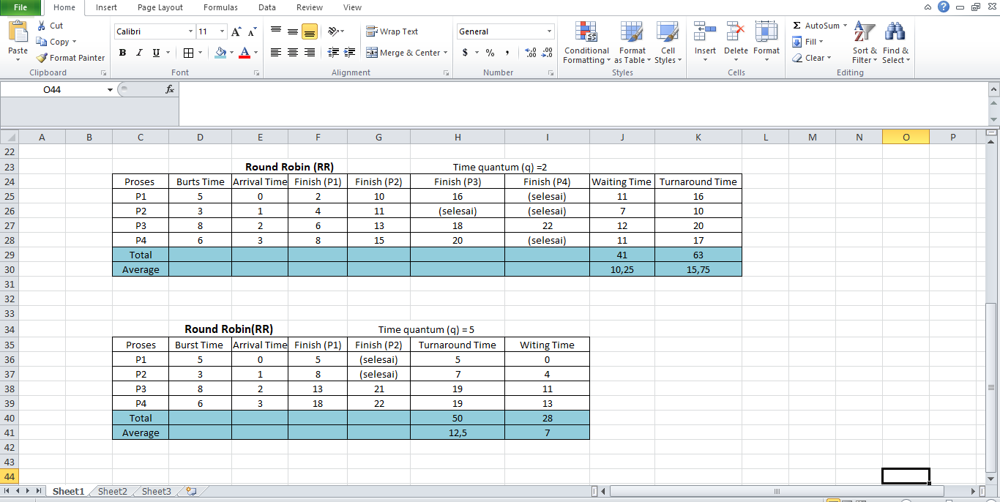

# Laporan Praktikum Minggu 6
**Topik: Penjadwalan CPU – Round Robin (RR) dan Priority Scheduling**


---

## Identitas
- **Nama**  : Rizzca Anggraeny
- **NIM**   : 250320578 
- **Kelas** : 1DSRA

---

## Tujuan
Setelah menyelesaikan tugas ini, mahasiswa mampu:
1. Menghitung *waiting time* dan *turnaround time* pada algoritma RR dan Priority.  
2. Menyusun tabel hasil perhitungan dengan benar dan sistematis.  
3. Membandingkan performa algoritma RR dan Priority.  
4. Menjelaskan pengaruh *time quantum* dan prioritas terhadap keadilan eksekusi proses.  
5. Menarik kesimpulan mengenai efisiensi dan keadilan kedua algoritma.  

---

## Dasar Teori
1. Konsep Penjadwalan CPU
   penjadwalan CPU adalah mekanisme yang menentukan proses mana yang memperoleh giliran menggunakan CPU. Penjadwalan dapat bersifat
   preemptive maupun non-preemptive, dengan tujuan meningkatkan efisiensi, mengurangi waktu tunggu, dan menjaga fairness sebagaimana
   dijelaskan pula oleh Tanenbaum & Bos (2015). OSTEP (2018) menekankan adanya trade-off antara responsivitas dan efisiensi.
3. Round Robin – Mekanisme Dasar
   Round Robin merupakan algoritma preemptive dengan pembagian waktu secara merata melalui time quantum. Proses dijalankan secara
   bergantian dalam antrian FIFO dan dipindahkan ke bagian belakang antrian apabila quantum habis. Penjelasan ini sejalan dengan
   Silberschatz (Bab 5) dan Tanenbaum (Bab 2), sedangkan Linux (sched_rr) menerapkannya sebagai penjadwalan real-time berbasis quantum.
4. Kelebihan dan Kelemahan Round Robin
   Round Robin menawarkan fairness dan responsivitas yang baik untuk sistem time-sharing. Namun, quantum yang
   terlalu kecil meningkatkan context switching, dan quantum terlalu besar mengurangi fairness. OSTEP (2018) menyoroti bahwa pemilihan
   quantum merupakan kompromi antara efisiensi dan keadilan.
5. Priority Scheduling – Mekanisme Dasar
   Priority Scheduling memilih proses berdasarkan tingkat prioritas, baik statis maupun dinamis. Algoritma ini dapat bersifat preemptive
   atau non-preemptive, sebagaimana dijelaskan oleh Silberschatz (2018). Tanenbaum membedakan prioritas internal dan eksternal, sementara
   OSTEP menekankan potensi starvation dan pentingnya aging sebagai mekanisme koreksi. Implementasi praktisnya dapat ditemukan pada Linux
   melalui sched_fifo dan kombinasi prioritas dengan sched_rr.
6. Kelebihan dan Kelemahan Priority Scheduling
   Priority Scheduling efektif untuk proses kritis dan real-time (Tanenbaum & Bos, 2015). Namun, proses prioritas rendah dapat mengalami
   starvation tanpa aging, sebagaimana dikemukakan oleh OSTEP dan Silberschatz. Kompleksitas penentuan prioritas serta potensi
   ketidakadilan juga menjadi pertimbangan penting dalam penerapan algoritma ini.


---

## Langkah Praktikum
1. **Siapkan Data Proses**
   Gunakan contoh data berikut (boleh dimodifikasi sesuai kebutuhan):
   | Proses | Burst Time | Arrival Time | Priority |
   |:--:|:--:|:--:|:--:|
   | P1 | 5 | 0 | 2 |
   | P2 | 3 | 1 | 1 |
   | P3 | 8 | 2 | 4 |
   | P4 | 6 | 3 | 3 |

2. **Eksperimen 1 – Round Robin (RR)**
   - Gunakan *time quantum (q)* = 3.  
   - Hitung *waiting time* dan *turnaround time* untuk tiap proses.  
   - Simulasikan eksekusi menggunakan Gantt Chart (manual atau spreadsheet).  
     ```
     | P1 | P2 | P3 | P4 | P1 | P3 | ...
     0    3    6    9   12   15   18  ...
     ```
   - Catat sisa *burst time* tiap putaran.

3. **Eksperimen 2 – Priority Scheduling (Non-Preemptive)**
   - Urutkan proses berdasarkan nilai prioritas (angka kecil = prioritas tinggi).  
   - Lakukan perhitungan manual untuk:
     ```
     WT[i] = waktu mulai eksekusi - Arrival[i]
     TAT[i] = WT[i] + Burst[i]
     ```
   - Buat tabel perbandingan hasil RR dan Priority.

4. **Eksperimen 3 – Analisis Variasi Time Quantum (Opsional)**
   - Ubah *quantum* menjadi 2 dan 5.  
   - Amati perubahan nilai rata-rata *waiting time* dan *turnaround time*.  
   - Buat tabel perbandingan efek *quantum*.

5. **Eksperimen 4 – Dokumentasi**
   - Simpan semua hasil tabel dan screenshot ke:
     ```
     praktikum/week6-scheduling-rr-priority/screenshots/
     ```
   - Buat tabel perbandingan seperti berikut:

     | Algoritma | Avg Waiting Time | Avg Turnaround Time | Kelebihan | Kekurangan |
     |------------|------------------|----------------------|------------|-------------|
     | RR | ... | ... | Adil terhadap semua proses | Tidak efisien jika quantum tidak tepat |
     | Priority | ... | ... | Efisien untuk proses penting | Potensi *starvation* pada prioritas rendah |

6. **Commit & Push**
   ```bash
   git add .
   git commit -m "Minggu 6 - CPU Scheduling RR & Priority"
   git push origin main
   ```


---

## Kode / Perintah
```bash
WT[i] = waktu mulai eksekusi - Arrival[i]
TAT[i] = WT[i] + Burst[i]
Average Waiting Time (WT) = Total WT / Jumlah Proses
Average Turnaround Time (TAT) = Total TAT / Jumlah Proses
```

---

## Hasil Eksekusi


*Eksperimen 1 – Round Robin (RR)*
- Gunakan *time quantum (q)* = 3.  
- Hitung *waiting time* dan *turnaround time* untuk tiap proses.
  
**Round Robin (RR)** time quantum (q) =3
| Proses | Burst Time | Arrival Time | Finish Time P1 | Finish Time P2 | Finish Time P3 | TAT (FT - AT) | WT (TAT - BT) |
| :--- | :--- | :--- | :--- | :--- | :--- | :--- | :--- |
| P1 | 5 | 0 | 3 (sisa 2) | 14 (selesai) | - | 14 - 0 = 14 | 14 - 5 = 9 |
| P2 | 3 | 1 | 6 (selesai) | - | - | 6 - 1 = 5 | 5 - 3 = 2 |
| P3 | 8 | 2 | 9 (sisa 5) | 17 (sisa 2) | 22 (selesai ) | 22 - 2 = 20 | 20 - 8 = 12 |
| P4 | 6 | 3 | 12 (sisa 3) | 20 (selesai ) | - | 20 - 3 = 17 | 17 - 6 = 11 |
|Average|  |   |     |       |     |     14 |8,5|


Simulasi eksekusi menggunakan Gantt Chart

```
   | P1 | P2 | P3 | P4 | P1 | P3 | P4 | P3 |
   0    3    6    9   12   14   17   20   22
```
- Catat sisa *burst time* tiap putaran.
  Sebelum eksekusi (awal)
  P1=5, P2=3, P3=8, P4=6
  Putaran 1 (setiap proses yang sudah datang mendapat 1 giliran)
  - P1: 5 − 3 = 2 (waktu 0→3)
  - P2: 3 − 3 = 0 (selesai) (3→6)
  - P3: 8 − 3 = 5 (6→9)
  - P4: 6 − 3 = 3 (9→12)
→ Sisa setelah Putaran 1: P1=2, P2=0, P3=5, P4=3
  
  Putaran 2 (hanya proses dengan sisa > 0: P1, P3, P4)
  - P1: 2 − 2 = 0 (selesai) (12→14)
  - P3: 5 − 3 = 2 (14→17)
  -  P4: 3 − 3 = 0 (selesai) (17→20)
→ Sisa setelah Putaran 2: P1=0, P2=0, P3=2, P4=0

Putaran 3 (tersisa P3 saja)
- P3: 2 − 2 = 0 (selesai) (20→22)
→ Semua selesai.

---

*Eksperimen 2 – Priority Scheduling (Non-Preemptive)*

Hasil Perhitungan
**Priority Scheduling (Non-Preemptive)**

| Proses | Arrival Time | Burst Time | Priority | Start | Finish Time (Start - BT) | WT (Start - AT) | TAT (WT + BT)
| :--- | :--- | :--- | :--- | :--- | :--- | :--- | :--- |
| P1 | 0 | 5 | 2 | 0 | 0 + 5 = 5 | 0 - 0 = 0 | 0 + 5 = 5 |
| P2 | 1 | 3 | 1 | 5 | 5 + 3 = 8 | 5 - 1 = 4 | 4 + 3 = 7 |
| P4 | 3 | 6 | 3 | 8 | 8 + 6 = 14 | 8 - 3 = 5 | 5 + 6 = 11 |
| P3 | 2 | 8 | 4 | 14 | 14 + 8 = 22 | 14 - 2 = 12 | 12 + 8 = 20 |
|Total|  |   |   |    |             |21  |43|
|Average|  |  |  |    |             |5,25| 10,75|

Simulasi eksekusi menggunakan Gantt Chart

```
   | P1 | P2 | P3 | P4 |
   0    5    8    14   22
```
  - Urutkan proses berdasarkan nilai prioritas (angka kecil = prioritas tinggi).
    -> P2 → P1 → P3 → P4   
   - Lakukan perhitungan manual untuk:
     ```
     WT[i] = waktu mulai eksekusi - Arrival[i]
     TAT[i] = WT[i] + Burst[i]
     ```
    - Waiting time 
     - P1= 0-0 = 0
     - P2= 5-1 = 4
     - P3= 8-3 = 5
     - P4= 14-2 = 12

    - Turnaround Time 
     - P1= 0+5 = 5
     - P2= 4+3 = 7
     - P3= 5+6 = 11
     - P4= 12+8 = 20
     
- Buat tabel perbandingan hasil RR dan Priority.
  *Tabel Perbandingan RR dan Priority Scheduling*

| Proses | RR WT | RR TAT | RR Completion | Priority WT | Priority TAT | Priority            |
| -----: | ----: | -----: | ------------: | ----------: | -----------: | ------------------: |
|     P1 |     9 |     14 |            14 |           0 |            5 |                   5 |
|     P2 |     2 |      5 |             6 |           4 |            7 |                   8 |
|     P3 |    12 |     20 |            22 |          12 |           20 |                  22 |
|     P4 |    11 |     17 |            20 |           5 |           11 |                  14 |

## Ringkasan
| Keterangan | RR   | Priority |
|------------|------|-----------|
| Avg WT     | 8.5  | 5.25      |
| Avg TAT    | 14   | 10.75     |
---

**Eksperimen 3 – Analisis Variasi Time Quantum (Opsional)**


  - Ubah *quantum* menjadi 2 dan 5.  
 
- Round Robin (RR) – Time Quantum (q = 2)

Hasil Perhitungan

| Proses | Burst Time | Arrival Time | Finish Time P1 | Finish Time P2 | Finish Time P3 | Finish Time P4 |TAT (FT - AT) | WT (TAT - BT) |
| :--- | :--- | :--- | :--- | :--- | :--- | :--- | :--- | :--- |
| P1 | 5 | 0 | 2 (sisa 3) | 10 (sisa 1) | 16 (selesai) | - | 16 - 0 = 16 | 16 - 5 = 11 |
| P2 | 3 | 1 | 4 (sisa 1) | 11 (selesai) | - | - | 11 - 1 = 10 | 10 - 3 = 7 |
| P3 | 8 | 2 | 6 (sisa 6) | 13 (sisa 4) | 18 (sisa 2) | 22 (selesai) | 22 - 2 = 20 | 20 - 8 = 12 |
| P4 | 6 | 3 | 8 (sisa 4) | 15 (sisa2) | 20 (selesai) | - | 20 - 3 = 17 | 17 - 6 = 11 |

Simulasi eksekusi menggunakan Gantt Chart

```
   | P1 | P2 | P3 | P4 | P1 | P2 | P3 | P4 | P1 | P3 | P4 | P3 |
   0    2    4    6    8   10   11   13   15   16   18    20   22
```

- Round Robin (RR) – Time Quantum (q = 5)

|    Proses   | Burst Time | Arrival Time | Finish (P1) | Finish (P2) | Finish (P3) | Finish (P4) | Waiting Time | Turnaround Time |
| :---------: | :--------: | :----------: | :---------: | :---------: | :---------: | :---------: | :----------: | :-------------: |
|      P1     |      5     |       0      |      5      |  (Selesai)  |  (Selesai)  |  (Selesai)  |       0      |        5        |
|      P2     |      3     |       1      |      8      |  (Selesai)  |  (Selesai)  |  (Selesai)  |       4      |        7        |
|      P3     |      8     |       2      |      13     |      18     |      22     |  (Selesai)  |      11      |        19       |
|      P4     |      6     |       3      |      18     |      22     |  (Selesai)  |  (Selesai)  |      13      |        19       |
|  *Total*  |            |              |             |             |             |             |    *28*    |      *50*     |
| *Average* |            |              |             |             |             |             |     *7*    |     *12,5*    |

Simulasi eksekusi menggunakan Gantt Chart

```
   | P1 | P2 | P3 | P4 | P3 | P4 |
   0    5    8   13   18   21   22
```

  - Amati perubahan nilai rata-rata *waiting time* dan *turnaround time*.  
  - Buat tabel perbandingan efek *quantum*.
    
| Time Quantum (q) | Avg Waiting Time | Avg Turnaround Time | Jumlah Context Switching | Efisiensi CPU | Karakteristik Umum                                                        |
|:----------------:|-----------------:|--------------------:|:------------------------:|:-------------:|:-------------------------------------------------------------------------|
|       *2*      |            10.25 |               15.75 | Tinggi (sering)          | Rendah        | Fair untuk semua proses, tetapi banyak waktu terbuang untuk context switch |
|       *3*      |             8.50 |               14.00 | Sedang                   | Sedang        | Keseimbangan antara keadilan dan efisiensi — hasil paling seimbang         |
|       *5*      |             7.00 |               12.50 | Rendah (jarang)          | Tinggi        | Mendekati FCFS: efisien untuk throughput, tapi fairness menurun          |

---
## Tugas
1. Hitung waiting time dan turnaround time untuk algoritma RR dan Priority.
   
   **Round Robin (RR)** time quantum (q) =3
   
| Proses | Burst Time | Arrival Time | Finish Time P1 | Finish Time P2 | Finish Time P3 | TAT (FT - AT) | WT (TAT - BT) |
| :--- | :--- | :--- | :--- | :--- | :--- | :--- | :--- |
| P1 | 5 | 0 | 3 (sisa 2) | 14 (selesai) | - | 14 - 0 = 14 | 14 - 5 = 9 |
| P2 | 3 | 1 | 6 (selesai) | - | - | 6 - 1 = 5 | 5 - 3 = 2 |
| P3 | 8 | 2 | 9 (sisa 5) | 17 (sisa 2) | 22 (selesai ) | 22 - 2 = 20 | 20 - 8 = 12 |
| P4 | 6 | 3 | 12 (sisa 3) | 20 (selesai ) | - | 20 - 3 = 17 | 17 - 6 = 11 |
|Average|  |   |     |       |     |     14 |8,5|


**Priority Scheduling (Non-Preemptive)**

| Proses | Arrival Time | Burst Time | Priority | Start | Finish Time (Start - BT) | WT (Start - AT) | TAT (WT + BT)
| :--- | :--- | :--- | :--- | :--- | :--- | :--- | :--- |
| P1 | 0 | 5 | 2 | 0 | 0 + 5 = 5 | 0 - 0 = 0 | 0 + 5 = 5 |
| P2 | 1 | 3 | 1 | 5 | 5 + 3 = 8 | 5 - 1 = 4 | 4 + 3 = 7 |
| P4 | 3 | 6 | 3 | 8 | 8 + 6 = 14 | 8 - 3 = 5 | 5 + 6 = 11 |
| P3 | 2 | 8 | 4 | 14 | 14 + 8 = 22 | 14 - 2 = 12 | 12 + 8 = 20 |
|Total|  |   |   |    |             |21  |43|
|Average|  |  |  |    |             |5,25| 10,75|

**Round Robin (RR) – Time Quantum (q = 2)**

| Proses | Burst Time | Arrival Time | Finish Time P1 | Finish Time P2 | Finish Time P3 | Finish Time P4 |TAT (FT - AT) | WT (TAT - BT) |
| :--- | :--- | :--- | :--- | :--- | :--- | :--- | :--- | :--- |
| P1 | 5 | 0 | 2 (sisa 3) | 10 (sisa 1) | 16 (selesai) | - | 16 - 0 = 16 | 16 - 5 = 11 |
| P2 | 3 | 1 | 4 (sisa 1) | 11 (selesai) | - | - | 11 - 1 = 10 | 10 - 3 = 7 |
| P3 | 8 | 2 | 6 (sisa 6) | 13 (sisa 4) | 18 (sisa 2) | 22 (selesai) | 22 - 2 = 20 | 20 - 8 = 12 |
| P4 | 6 | 3 | 8 (sisa 4) | 15 (sisa2) | 20 (selesai) | - | 20 - 3 = 17 | 17 - 6 = 11 |

**Round Robin (RR) – Time Quantum (q = 5)**

|    Proses   | Burst Time | Arrival Time | Finish (P1) | Finish (P2) | Finish (P3) | Finish (P4) | Waiting Time | Turnaround Time |
| :---------: | :--------: | :----------: | :---------: | :---------: | :---------: | :---------: | :----------: | :-------------: |
|      P1     |      5     |       0      |      5      |  (Selesai)  |  (Selesai)  |  (Selesai)  |       0      |        5        |
|      P2     |      3     |       1      |      8      |  (Selesai)  |  (Selesai)  |  (Selesai)  |       4      |        7        |
|      P3     |      8     |       2      |      13     |      18     |      22     |  (Selesai)  |      11      |        19       |
|      P4     |      6     |       3      |      18     |      22     |  (Selesai)  |  (Selesai)  |      13      |        19       |
|  *Total*  |            |              |             |             |             |             |    *28*    |      *50*     |
| *Average* |            |              |             |             |             |             |     *7*    |     *12,5*    |

3. Sajikan hasil perhitungan dan Gantt Chart dalam laporan.md.
   
 RR quantum 3

```
| P1 | P2 | P3 | P4 | P1 | P3 | P4 | P3 |
0    3    6    9   12   14   17   20   22
```

RR quantum 2
```
| P1 | P2 | P3 | P1 | P4 | P2 | P3 | P1 | P4 | P3 | P4 | P3 |
0    2    4    6    8   10   11   13   14   16   18   20   22
```

RR quantum 5
```
| P1 | P2 | P3   | P4   | P3  | P4 |
0    5    8    13   18   21   22
```

Priority Scheduling (Non-Preemptive)
```
|  P1  |  P2  |   P4   |    P3    |
0      5      8        14        22
```

5. Bandingkan performa dan jelaskan pengaruh time quantum serta prioritas.


**Perbandingan Performa**


| Algoritma                          | Rata-rata WT | Rata-rata TAT | Ringkasan Performa                                                                 |
|------------------------------------|--------------|---------------|------------------------------------------------------------------------------------|
| Priority Scheduling (Non-Preemptive) | 5.25         | 10.75         | Performa terbaik karena proses prioritas tinggi mendapat CPU lebih dulu sehingga WT lebih rendah. |
| Round Robin (q = 5)                | 7            | 12.5          | Quantum besar → mirip FCFS, interupsi sedikit, WT lebih rendah dibanding quantum kecil. |
| Round Robin (q = 3)                | 8.5          | 14            | Fairness meningkat, tapi interupsi lebih sering menyebabkan WT dan TAT lebih tinggi. |
| Round Robin (q = 2)                | 10.25        | 15.75         | Quantum kecil → sangat responsif tetapi context switch banyak, sehingga WT & TAT paling tinggi. |

 **Pengaruh Time Quantum & Prioritas**

| Mekanisme                  | Pengaruh                          | Penjelasan Singkat                                      |
|----------------------------|-----------------------------------|---------------------------------------------------------|
| Quantum kecil (q = 2)      | Fairness tinggi; WT & TAT meningkat | Interupsi sering → overhead besar.                      |
| Quantum sedang (q = 3)     | Seimbang                          | Kombinasi adil dan cukup efisien.                       |
| Quantum besar (q = 5)      | WT & TAT lebih baik               | Interupsi sedikit → mirip penjadwalan non-preemptive.   |
| Prioritas tinggi (angka kecil) | WT rendah                         | Proses penting dieksekusi lebih dulu.                   |
| Prioritas rendah (angka besar) | WT tinggi; risiko starvation      | Harus menunggu proses prioritas tinggi selesai.

1. Perbandingan Performa

Performa penjadwalan CPU dilihat dari Waiting Time (WT) dan Turnaround Time (TAT). Semakin rendah nilai rata-ratanya, semakin baik kinerja algoritma. Priority Scheduling (Non-Preemptive)
Memiliki performa paling baik karena proses dengan prioritas lebih tinggi langsung dieksekusi lebih dulu. Hal ini membuat waktu tunggu beberapa proses menjadi lebih kecil.
Round Robin dengan quantum besar (q=5)
Memberikan performa lebih baik dibanding RR dengan quantum kecil karena proses tidak terlalu sering diinterupsi. Polanya mirip dengan FCFS, sehingga waktu tunggunya relatif rendah.
Round Robin dengan quantum sedang (q=3)
Memberikan keseimbangan antara keadilan dan efisiensi. Namun, karena proses masih cukup sering diinterupsi, nilai WT dan TAT tetap lebih tinggi dibanding quantum besar.
Round Robin dengan quantum kecil (q=2)
Paling sering melakukan pergantian proses, membuat WT dan TAT tertinggi karena beban pergantian konteks meningkat.


Kesimpulan singkat:
Prioritas memberikan performa terbaik, RR dengan quantum besar cukup efisien, sedangkan RR dengan quantum kecil memberikan keadilan tetapi kurang efisien.

2. Pengaruh Time Quantum pada Round Robin

Time quantum menentukan berapa lama suatu proses berjalan sebelum digantikan proses lain.
Quantum kecil (misal q=2) Proses sering diinterupsi Respons cepat
Overhead pergantian konteks tinggi
→ WT dan TAT menjadi besar.
Quantum besar (misal q=5) Proses jarang diinterupsi Overhead kecil mirip FCFS
→ WT dan TAT lebih kecil, lebih efisien.
Quantum sedang (misal q=3) Menjadi titik tengah antara respons cepat dan efisiensi. Fairness tetap terjaga, tetapi performa tidak sebaik quantum besar.
Ringkas:
Quantum kecil = adil tapi tidak efisien
Quantum besar = efisien tapi bisa kurang adil

3. Pengaruh Prioritas pada Priority Scheduling
   Pada sistem ini, proses dengan prioritas tertinggi akan dijalankan lebih dulu.
   Proses prioritas tinggi mendapat CPU lebih cepat → WT dan TAT kecil proses prioritas rendah sering menunggu lama → WT dan TAT besar
  Jika tidak ada mekanisme penyeimbang seperti “aging”, proses prioritas rendah bisa “kelaparan” karena tidak pernah dapat bagian CPU.

6. Simpan semua bukti (tabel, grafik, atau gambar) ke folder screenshots/.

---

## Kesimpulan
Praktikum menunjukkan bahwa Priority Scheduling memberikan performa terbaik karena mampu memproses tugas prioritas tinggi lebih cepat, meskipun berisiko menimbulkan starvation pada proses berprioritas rendah. Pada Round Robin, performa sangat dipengaruhi oleh time quantum:
Quantum kecil meningkatkan respons tetapi membuat WT dan TAT tinggi karena banyak context switch. Quantum sedang memberikan hasil menengah. Quantum besar lebih efisien dan menghasilkan WT dan TAT lebih rendah. Secara umum, Priority Scheduling cocok untuk tugas penting, sedangkan Round Robin ideal untuk sistem interaktif yang membutuhkan pemerataan CPU.


---

## Quiz
1. Apa perbedaan utama antara Round Robin dan Priority Scheduling? 
   Jawaban: Round Robin membagi CPU secara bergiliran dengan time quantum tetap. Setiap proses mendapat giliran yang sama, sehingga          adil dan cocok untuk sistem interaktif, meski menyebabkan banyak context switch jika quantum kecil.
   Priority Scheduling memberi CPU pada proses dengan prioritas tertinggi. Efisien untuk tugas penting, tetapi proses prioritas rendah       bisa menunggu lama tanpa mekanisme aging. 
2.Apa pengaruh besar/kecilnya time quantum terhadap performa sistem?
   Jawaban:
   Quantum kecil → Sistem lebih responsif dan adil, tetapi context switch sangat sering sehingga WT dan TAT meningkat.
   Quantum besar → Context switch lebih sedikit sehingga WT dan TAT menurun, tetapi sistem jadi kurang responsif dan proses pendek bisa      menunggu lama.
   Quantum sedang → Memberikan keseimbangan antara responsivitas dan efisiensi.  
3.Mengapa algoritma Priority dapat menyebabkan starvation?
   Jawaban: Priority Scheduling bisa menyebabkan starvation karena proses dengan prioritas tinggi selalu didahulukan. Jika proses            prioritas tinggi terus muncul, proses prioritas rendah bisa menunggu sangat lama dan tidak pernah mendapat giliran.
   Cara mencegahnya: gunakan aging, yaitu menaikkan prioritas proses yang sudah terlalu lama menunggu. 

---

## Refleksi Diri
Tuliskan secara singkat:
- Apa bagian yang paling menantang minggu ini?
  jawaban : menghitung round robin dengan time yang berbeda -beda
- Bagaimana cara Anda mengatasinya?
  jawaban : mencari referensi lewat youtobe atau website 

---

**Credit:**  
_Template laporan praktikum Sistem Operasi (SO-202501) – Universitas Putra Bangsa_
