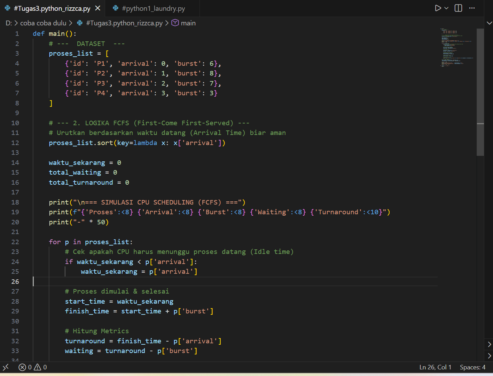
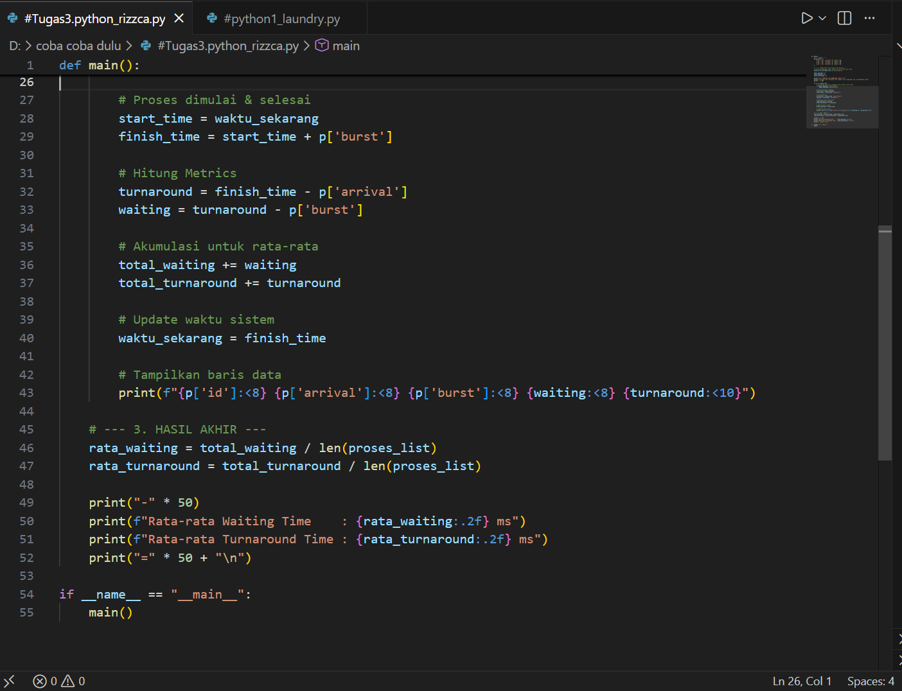
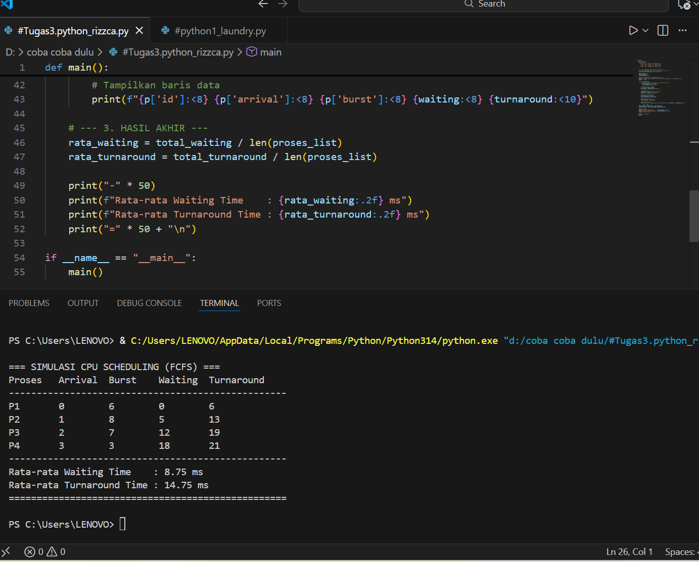
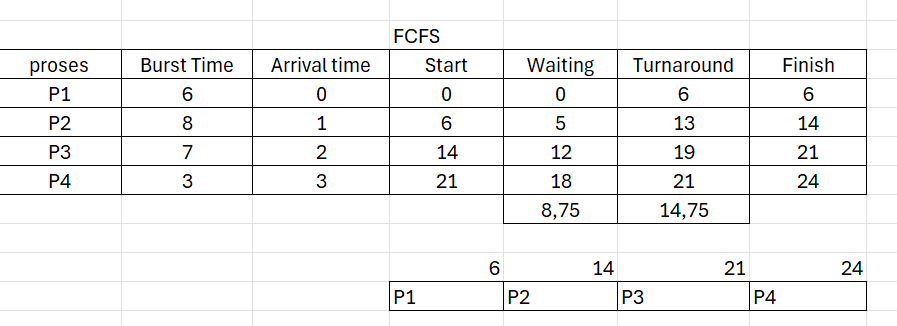
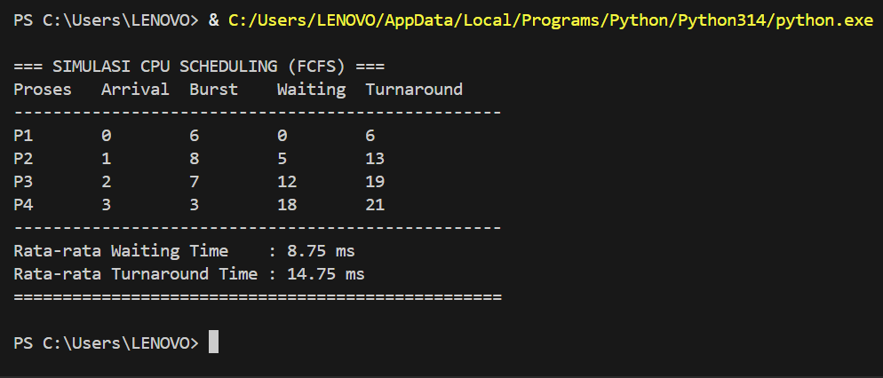

# Laporan Praktikum Minggu 9
Topik: Simulasi Algoritma Penjadwalan CPU  


---

## Identitas
- **Nama**  : Rizzca Anggraeny 
- **NIM**   : 250320578 
- **Kelas** : 1DSRA

---

## A. Deskripsi Singkat
Pada praktikum minggu ini, mahasiswa akan **mengimplementasikan program simulasi sederhana algoritma penjadwalan CPU**, khususnya **FCFS dan SJF**.  
Berbeda dengan Minggu 5–6 yang berfokus pada perhitungan manual, pada minggu ini mahasiswa mulai **mengotomatisasi perhitungan menggunakan program**, menjalankan dataset uji, serta menyajikan hasil dalam bentuk tabel atau grafik.

Praktikum ini menjadi jembatan antara **pemahaman konseptual** dan **implementasi komputasional** algoritma sistem operasi.

---

## Tujuan
Setelah menyelesaikan tugas ini, mahasiswa mampu:
1. Membuat program simulasi algoritma penjadwalan FCFS dan/atau SJF.  
2. Menjalankan program dengan dataset uji yang diberikan atau dibuat sendiri.  
3. Menyajikan output simulasi dalam bentuk tabel atau grafik.  
4. Menjelaskan hasil simulasi secara tertulis.  
5. Mengunggah kode dan laporan ke Git repository dengan rapi dan tepat waktu.

---

## Dasar Teori
1. *Konsep Dasar*: Penjadwalan CPU menentukan urutan eksekusi proses untuk mengoptimalkan utilisasi CPU, meminimalkan waktu
   tunggu, dan responsivitas, berdasarkan atribut seperti arrival time, burst time, dan prioritas.
2. *Algoritma Utama*: FCFS (urutan kedatangan); SJF (burst terpendek); Round Robin (quantum tetap, preemptive); Priority
   (berdasarkan prioritas, risiko starvation).
3. *Metrik Performa*: Utilisasi CPU, waktu turnaround (kedatangan ke selesai), waktu tunggu (turnaround minus burst);
   simulasi membandingkan rata-rata untuk evaluasi algoritma.
4. *Langkah Simulasi*: Siapkan data proses, pilih algoritma, model eksekusi dengan loop waktu, buat diagram Gantt, hitung
   metrik.
5. *Implementasi*: Gunakan kode sederhana (e.g., Python untuk FCFS) atau simulator online; contoh: proses untuk menghitung
   waktu tunggu dan turnaround.
---

## Langkah Praktikum
1. **Menyiapkan Dataset**

   Buat dataset proses minimal berisi:

   | Proses | Arrival Time | Burst Time |
   |:--:|:--:|:--:|
   | P1 | 0 | 6 |
   | P2 | 1 | 8 |
   | P3 | 2 | 7 |
   | P4 | 3 | 3 |

2. **Implementasi Algoritma**

   Program harus:
   - Menghitung *waiting time* dan *turnaround time*.  
   - Mendukung minimal **1 algoritma (FCFS atau SJF non-preemptive)**.  
   - Menampilkan hasil dalam tabel.

3. **Eksekusi & Validasi**

   - Jalankan program menggunakan dataset uji.  
   - Pastikan hasil sesuai dengan perhitungan manual minggu sebelumnya.  
   - Simpan hasil eksekusi (screenshot).

4. **Analisis**

   - Jelaskan alur program.  
   - Bandingkan hasil simulasi dengan perhitungan manual.  
   - Jelaskan kelebihan dan keterbatasan simulasi.

5. **Commit & Push**

   ```bash
   git add .
   git commit -m "Minggu 9 - Simulasi Scheduling CPU"
   git push origin main
   ```

---

## Kode / Perintah
```bash
1. Menghitung waiting time dan turnaround time FCFS
```
def main():
    proses_list = [
        {'id': 'P1', 'arrival': 0, 'burst': 6},
        {'id': 'P2', 'arrival': 1, 'burst': 8},
        {'id': 'P3', 'arrival': 2, 'burst': 7},
        {'id': 'P4', 'arrival': 3, 'burst': 3},
    ]

    proses_list.sort(key=lambda x: x['arrival'])

    waktu_sekarang = 0
    total_waiting = 0
    total_turnaround = 0

    print("\n=== SIMULASI CPU SCHEDULING (FCFS) ===")
    print(f"{'Proses':<8} {'Arrival':<8} {'Burst':<8} {'Waiting':<8} {'Turnaround':<10}")
    print("-" * 50)

    for p in proses_list:
        if waktu_sekarang < p['arrival']:
            waktu_sekarang = p['arrival']

        start_time = waktu_sekarang
        finish_time = start_time + p['burst']

        turnaround = finish_time - p['arrival']
        waiting = turnaround - p['burst']

        total_waiting += waiting
        total_turnaround += turnaround
        
        waktu_sekarang = finish_time

        print(f"{p['id']:<8} {p['arrival']:<8} {p['burst']:<8} {waiting:<8} {turnaround:<10}")

    rata_waiting = total_waiting / len(proses_list)
    rata_turnaround = total_turnaround / len(proses_list)

    print("-" * 50)
    print(f"Rata-rata Waiting Time    : {rata_waiting:.2f} ms")
    print(f"Rata-rata Turnaround Time : {rata_turnaround:.2f} ms")
    print("=" * 50 + "\n")

if __name__ == "__main__":
    main()
   
```
2.  Menghitung waiting time dan turnaround time SJF
```
#Menghitung waiting time dan turnaround time SJF
def main():
    proses_list = [
        {'id': 'P1', 'arrival': 0, 'burst': 6},
        {'id': 'P2', 'arrival': 1, 'burst': 8},
        {'id': 'P3', 'arrival': 2, 'burst': 7},
        {'id': 'P4', 'arrival': 3, 'burst': 3},
    ]

    waktu_sekarang = 0
    total_waiting = 0
    total_turnaround = 0
    selesai = []

    print("\n=== SIMULASI CPU SCHEDULING (SJF) ===")
    print("-" * 80)
    print(f"{'Proses':<8} {'Arrival':<8} {'Burst':<8} {'Waiting':<8} {'Turnaround':<10}")
    print("-" * 80)

    while len(selesai) < len(proses_list):
        siap = []
        for p in proses_list:
            if p['arrival'] <= waktu_sekarang and p not in selesai:
                siap.append(p)

        if not siap:
            waktu_sekarang += 1
            continue

        p = min(siap, key=lambda x: x['burst'])

        start_time = waktu_sekarang
        finish_time = start_time + p["burst"]

        turnaround = finish_time - p['arrival']
        waiting = turnaround - p['burst']

        total_waiting += waiting
        total_turnaround += turnaround
        
        waktu_sekarang = finish_time
        selesai.append(p)

        print(f"{p['id']:<8} {p['arrival']:<8} {p['burst']:<8} {waiting:<8} {turnaround:<10}")

    rata_waiting = total_waiting / len(proses_list)
    rata_turnaround = total_turnaround / len(proses_list)

    print("-" * 80)
    print(f"Rata-rata Waiting Time    : {rata_waiting:.2f} ms")
    print(f"Rata-rata Turnaround Time : {rata_turnaround:.2f} ms")

if __name__ == "__main__":
    main()
```

---

## Hasil Eksekusi
Sertakan screenshot hasil percobaan atau diagram:



---

## Analisis
- Jelaskan alur program.
1. Mendefinisikan dataset proses
    - Setiap proses punya id, arrival time, dan burst time.
2. Mengurutkan proses berdasarkan Arrival Time
   - Supaya proses dieksekusi sesuai prinsip First-Come First-Served.
3. Inisialisasi variabel
   - waktu_sekarang untuk melacak waktu CPU.
   - total_waiting dan total_turnaround untuk menghitung rata-rata.
4. Menampilkan header tabel hasil simulasi
   - Menyiapkan tampilan data proses di terminal.
5. Perulangan setiap proses
   - Mengecek apakah CPU idle (menunggu proses datang).
   - Menentukan waktu mulai (start_time) dan selesai (finish_time).
6. Menghitung metrik
   - Turnaround Time = finish_time - arrival
   - Waiting Time = turnaround - burst
7. Menambahkan nilai ke total
   - Waiting Time dan Turnaround Time dijumlahkan untuk perhitungan rata-rata.
8. Memperbarui waktu sistem
   - waktu_sekarang diubah menjadi waktu selesai proses.
9. Menampilkan hasil tiap proses
    - Menunjukkan Arrival, Burst, Waiting, dan Turnaround Time.
10. Menghitung dan menampilkan hasil akhir
    - Rata-rata Waiting Time dan Turnaround Time.
11. Program dijalankan melalui fungsi main()
    - Mengeksekusi seluruh simulasi saat file dijalankan.
   
- Bandingkan hasil simulasi dengan perhitungan manual.
  

  
  
|     Proses    | Burst Time | Arrival Time | Start |  Waiting | Turnaround | Finish |
| :-----------: | :--------: | :----------: | :---: | :------: | :--------: | :----: |
|       P1      |      6     |       0      |   0   |     0    |      6     |    6   |
|       P2      |      8     |       1      |   6   |     5    |     13     |   14   |
|       P3      |      7     |       2      |   14  |    12    |     19     |   21   |
|       P4      |      3     |       3      |   21  |    18    |     21     |   24   |
| **Rata-rata** |            |              |       | **8.75** |  **14.75** |        |


 - FCFS
     - Waiting Time    : 8,75
     - Turnaround time : 14,75
- Hasil simulasi yaang menggunakan program :
    

  
- FCFS
     - Waiting Time    : 8,75
     - Turnaround time : 14,75
  
- Jelaskan kelebihan dan keterbatasan simulasi.
###  Kelebihan Simulasi

1. *Keamanan dan Efisiensi Biaya*: Virtual, hindari risiko hardware dan biaya tinggi, izinkan percobaan berulang.
2. *Kontrol Parameter*: Mudah sesuaikan variabel untuk uji skenario dan amati dampak kinerja.
3. *Visualisasi*: Diagram Gantt tampilkan eksekusi secara grafis, mudahkan pemahaman algoritma.
4. *Perbandingan Algoritma*: Analisis langsung antaralgoritma berdasarkan metrik tanpa gangguan eksternal.
5. *Pendidikan*: Dukung pembelajaran konsep via eksperimen tanpa kompleksitas sistem nyata.

### Keterbatasan Simulasi 
1. *Kurang Realistis*: Asumsi ideal, tidak cerminkan dunia nyata dengan gangguan I/O atau preemption.
2. *Skalabilitas Terbatas*: Lambat untuk sistem besar, tidak tangani paralelisme multi-inti.
3. *Akurasi Bergantung Model*: Hasil tergantung model; kesalahan kode sebabkan data tidak akurat.
4. *Fokus Terbatas*: Hanya CPU, abaikan aspek lain seperti I/O atau memori.
5. *Risiko Kesalahan*: Rentan bug manual, tidak cakup variabilitas acak seperti kegagalan hardware.
---

## Kesimpulan
1. Praktikum ini membantu memahami cara sistem operasi mengatur eksekusi proses di CPU, dengan fokus pada algoritma seperti
   FCFS, SJF, Round Robin, dan Priority Scheduling. Melalui simulasi virtual, peserta bisa menguji pengaruh faktor seperti
   waktu burst dan quantum terhadap performa, seperti waktu tunggu dan pemanfaatan CPU, tanpa risiko pada perangkat keras
   asli.

2. Kelebihan utamanya adalah keamanan, kemampuan mengubah parameter dengan mudah, visualisasi jelas melalui diagram Gantt,
   dan perbandingan algoritma untuk menemukan yang terbaik. Namun, ada keterbatasan seperti kurangnya kesesuaian dengan
   dunia nyata, kesulitan menangani sistem besar, dan fokus hanya pada CPU saja.

---

## Quiz
1. Mengapa simulasi diperlukan untuk menguji algoritma scheduling?
   - Simulasi diperlukan untuk menguji algoritma scheduling karena memungkinkan pengujian kinerja secara aman, hemat
     biaya, dan terkontrol tanpa mengganggu sistem nyata. Melalui simulasi, berbagai algoritma dapat dibandingkan                 secara adil dengan kondisi yang sama serta diuji pada berbagai skenario beban sistem sebelum diterapkan secara               langsung.
2. Apa perbedaan hasil simulasi dengan perhitungan manual jika dataset besar?
   - perbedaannya terletak pada prosesnya. Simulasi menggunakan program lebih cepat, konsisten, dan minim kesalahan**,
     sehingga mampu menangani banyak proses dengan akurat. Sebaliknya, perhitungan manual membutuhkan **waktu lama**, mudah
     terjadi kesalahan hitung, dan kurang efisien jika jumlah proses banyak. Oleh karena itu, perhitungan manual cocok untuk
     memahami konsep dasar, sedangkan simulasi lebih tepat untuk analisis dataset besar.
  3. Algoritma mana yang lebih mudah diimplementasikan? Jelaskan.
   - Algoritma FCFS (First-Come First-Served) adalah yang paling mudah diimplementasikan karena proses dijalankan
     sesuai urutan kedatangan tanpa aturan tambahan. Logikanya sederhana dan perhitungannya mudah, sehingga lebih mudah
     dipahami dibandingkan algoritma lain seperti SJF atau Round Robin yang membutuhkan mekanisme tambahan.


---

## Refleksi Diri
Tuliskan secara singkat:
- Apa bagian yang paling menantang minggu ini?
  - Menentukan urutan eksekusi saat beberapa proses masuk ke sistem dalam waktu yang hampir bersamaan
- Bagaimana cara Anda mengatasinya?
  - Dengan melihat perbedaan waktu kedatangan yang paling kecil dan menjalankan proses yang terdeteksi masuk lebih dulu.

---

**Credit:**  
_Template laporan praktikum Sistem Operasi (SO-202501) – Universitas Putra Bangsa_
